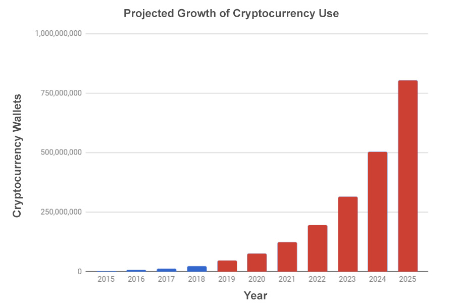

# Introduction

Welcome to the Divi Project documentation repository! This service provides a comprehensive overview of everything in the Divi ecosystem. Use the navigation pane at the left side of this page to select the documentation you would like to read.

# Contribute

If you would like to contribute to the Divi Project Documentation, fork [this repository](https://github.com/divicoin/docs) and check out the README to get started!

# Security Hygiene Best Practices

Cryptocurrency gives users the power to control their own finances. As with any great power,it must be wielded with great responsibility. Below are some Pro Tips for keeping your personal security hygenic and, most importantly, under _your_ control.

## Encrypt your wallet via the Desktop Smart Wallet &trade;

Upon first opening the Divi Desktop Smart Wallet &trade;, you will be prompted to secure your account's funds with encryption. This is _highly_ recommended and can be done in about 30 seconds. Simply set your password, confirm it, wait for the daemon to restart, and you're on your way to a more secure crypto user experience!

## Backup your wallet with a mnemonic seed phrase

Divi does not have access to any indivdual accounts and cannot recover funds if they are lost. To prevent loss of funds, it is recommended that you take advantage of our HD Mnemonic Seed Phrase feature. This feature will generate a random, 24-word phrase that can be used to recover your wallet should you lose access to it.

## Keep your passwords and seed phrase offline

Do not, we repeat, _do not_, store your encryption password or mnemonic seed phrase online. In fact, it is recommended that you keep this information completely analog. This means, do not store your private information in a Word document on a computer that connects to the internet. The best practice is to write your password and mnemonic down on a piece of paper and store it somewhere safe, like a safe.

## Never share your wallet files with anyone

Members of the Divi team will never request access to your `wallet.dat` or any other file deemed proprietary to your account. If a member of the community or someone claiming to be a Divi team member makes an attempt to access this data, please report them immediately to an Admin.

# FAQ / Troubleshooting

## General FAQs

**Q: Where can I fill out a support ticket or find live support?**

A: You can create an account and open a support ticket [here](https://diviproject.org/auth) or join us on our [Telegram Support Channel](https://t.me/divisupport)  You can get Community help on [our Forum](https://forum.diviproject.org/c/support)

**Q: Where can I share my great ideas to enhance Divi?**

A: Come join us on our [forum](https://forum.diviproject.org)

**Q: What are the implemented core Divi features that stand out from other projects?**

A: Read about some of our unique features [here](https://blog.diviproject.org/divi-solving-problems/)

**Q: Who is the team behind Divi?**

A: You can view our stellar team [here](https://diviproject.org/#team)

**Q: What is diviscan.io?**

A: Diviscan is our block explorer, where you can view vital information about the blockchain, search transaction hashes and addresses, and view block information.

**Q: Where can I find an updated roadmap?**

A: You can always view our roadmap [here](https://diviproject.org/roadmap)

**Q: What is the difference between DIVX and DIVI?**

A: DIVX, or Divi Exchange Token was a placeholder token that served as a fundraising vehicle to build the Divi protocol. DIVI is the main network coin used today.

**Q: What is the difference between Proof of Work, Proof of Stake and Delegated Proof of Stake?**

A: // TODO

**Q: Can I mine DIVI with a GPU or ASIC?**

A: DIVI is not mined, it is minted. As such, no specialized hardware is required to earn rewards. Better hardware will not give a single node the upper hand when earning.

**Q: Where is the official Divi Github located?**

A: Find our GitHub [here](https://github.com/divicoin)

**Q: What happens to the transaction fees that are generated on the system?**

A: Transaction fees in the Divi ecosystem are burned

**Q: Where do I report potential bugs?**

A: You can open a general, public support ticket [here](https://forum.diviproject.org/c/support) or for GUI or CORE bugs, go [here](https://github.com/divicoin/divi)

## Wallet FAQs

**Q: Where can I find the most up-to-date Divi wallet?**

A: You can download it right from [our website](https://diviproject.org/downloads)

**Q: Why do I continue to see a spinning red circle after my seed recovery says 100% completed?**

A: In the background, your node is being reindexed to accurately restore your balance and transaction history

**Q: Why does my wallet take so long to load?**

A: If your computer has an HDD, your wallet may take a bit longer to load. The system is building a brand new wallet file to store all your data. It is relatively complex, so be patient.

**Q: Why does my wallet take so long to sync?**

A: Depending on your system specs and network connection, your node may take longer than others to sync.

**Q: How do I know if I won a lottery block?**

A: Lottery blocks always come in 25 200 or 252 000 DIVI increments. You can view them in your GUI's Transaction History on the "Lottery" tab

**Q: Why do I sometimes see large transactions in my wallet?**

A: This is the result of a larger UTXO that is being reflected by your wallet. Whether it be a staking attempt or some other wallet activity, one of your accounts took part in the output of the transaction. Don’t worry, you didn’t lose or gain anything. It's just the blockchain acting as it should.

**Q: What should I do if my wallet continues to attempt to sync for over 30 minutes?**

A: Try [these instructions](#gui-is-stuck-syncing)

**Q: Where are my wallet and other critical files stored?**

A:

* Windows: C:\Users\<your-username>\AppData\Roaming\DIVI
* OSX: ~/Library/Application\ Support/DIVI
* Linux: ~/.divi

**Q: Where can I buy DIVI?**

A: You can find all our current exchange listings [here](https://wiki.diviproject.org/#exchanges)

**Q: What if my Divi wallet fails to start?**

A: Try exiting the application and restarting. If you’re still having issues, restart your computer and reopen Divi Desktop.  If you had an older version of the wallet, that may need to be completely removed before installing the new one.  On PC, check-in `/users/[yourname]/appdata/roaming` and delete the DIVI folders you see there.

**Q: My balance is 0. What happened to my funds?**

A: If you're using a Windows wallet, try going into Users\<your_username>\AppData\Roaming\DIVI, if you see both `wallet.dat` and `wallet.dat.rewrite` remove `wallet.dat` and rename `wallet.dat.rewrite` to `wallet.dat`

**Q: I don't see `wallet.dat.rewrite` but I see `wallet.dat` & `wallet.<numbers>.bak` or some equivalent.**

A: Stop the wallet. Move all `wallet.<numbers>.bak` and `wallet.dat` files to your desktop. Enter the `backups` directory and pull out one of the `wallet.dat` backup files into the main DIVI directory. Rename the file to `wallet.dat` and restart the wallet.

## Masternode FAQs

**Q: Am I able to host masternodes on my home computer without the need for cloud services?**

A: While it is important that you follow the Controller/Remote node structure, you can use a VM (Virtual Machine) in tandem with your standard machine to run a Masternode locally.

**Q: Do I need to keep my home computer turned on to receive masternode rewards?**

A: Not if you’re using our MOCCI. Once your masternode is deployed remotely (to the cloud), you may close the local Divi Desktop application.

**Q: How much should I expect to make with my masternode?**

A: You can view one of our community masternode calculators for an estimate

[Slater Masternode Calculator](https://slater.bubbleapps.io)
[Masternodes Online](https://masternodes.online)
[OriZ Calculator](https://docs.google.com/spreadsheets/d/1UD4Nh4JstM3fYsq2PG6cK0j3k0vkIEl6tp8UMfKdZfI/edit?usp=sharing)

**Q: Where can I track the profitability of various types of masternodes?**

A: [Masternodes.online](http://masternodes.online)

**Q: How long until my masternode is eligible for awards?**

A: The formula is 2.6 * # of Masternodes in the Network, in minutes.  So if there are 1200 masternodes, that will be 52 hours.

**Q: Am I required to use Digital Ocean to create my cloud-based Masternodes?**

A: If you choose to use the MOCCI, the node will be deployed to Digital Ocean. You can, however, set up a Masternode manually using [our guide](#masternode-setup-guide).

**Q: How do masternodes work in layman’s terms?**

A: Masternodes are special peers in the network that serve as a method of securing and verifying transactions. They require a certain number of coins to be allocated to them, and as a reward for supporting the network, they earn additional coins, which are sent to the wallet from which the Masternode was deployed.

**Q: When should I expect my first masternode reward?**

A: The selection algorithm is relatively complex, but you can read more about it [here](#rewards). Because we have developed the system to maintain decentralization and randomness, it is difficult to predict when a masternode will receive its first reward. Sometimes it is within 3 hours, sometimes 7 days. In the end, the system is built to average out rewards so that earnings are fair based on the masternode level selected.

**Q: Is there a partial refund if I decide to remove my masternode at any point during the month?**

A: The cost of the server is a flat fee and not based on usage. Each month is paid up front and cannot be refunded. You may cancel your subscription at any time.

**Q. Do I need to set up a VPS account for my masternode?**

A. You don’t NEED to do this.  If you deploy your masternode with MOCCI then we do it for you and you don’t need to do anything.  You can save yourself $5/month by doing it all yourself on your own VPS account.  You can even do it manually on your own home computer.

**Q. Can I deploy more than one masternode from the same local wallet?**

A. Yes, but only one at a time.  You have to wait until one is completely finished deploying before starting the next one.

**Q. How can I make sure my masternode has been deployed successfully?**

A. Try checking on https://diviscan.io/masternodes to find it there. Or, if you manually deployed, you can run `./divi-cli getmasternodestatus` from the command line on the machine where your Masternode is hosted.

## MOCCI FAQs

**Q. Why does it cost $15 to deploy a masternode?**

A. We pay Digital Ocean $10/month and the $5 is left over to cover overhead, etc.

**Q: My incoming masternode reward status has turned green. Why does my balance not reflect the reward?**

A: It may take 15-20 confirmations before your masternode rewards are reflected in your balance.

**Q: Am I able to host multiple masternodes in the cloud or with MOCCI using a single IP address or droplet?**

A: No. Each Masternode requires a unique, static IP address in its own droplet.

**Q: Should I create a new wallet address for each incoming transaction?**

A: It is a best practice to do this but it is not necessary.

**Q: Support asked me to submit a copy of my log file. Where is this file located?**

A:

* Windows: C:\Users\<your-username>\AppData\Roaming\DIVI\debug.log
* OSX: ~/Library/Application\ Support/DIVI/debug.log
* Linux: ~/.divi/debug.log

**Q: Why does my balance not decrease when I purchase a masternode?**

A: When you create a new masternode, the funds are allocated in a transaction that is broadcast to the network. It will take a few confirmations for this transaction to be validated, after which time you will see your funds reappear minus the transaction fee.

## MOCCI Hosting (PayPal Payment) FAQs

**Q: Why am I seeing "Redeployment Required?"**

A: If you have been running a masternode for longer than 2 months, the version of Divi Core that is running in the cloud requires an update and must be redeployed.

**Q: If I cancel my subscription early, do I receive a refund?**

A: The subscriptions are non-refundable but will last through the final day of your billing period once canceled.

**Q: If I dismantle a MOCCI masternode, will I have to pay to deploy another one?**

A: No, you can dismantle/deploy as many nodes of the same value as long as you do so within the same billing period.

**Q: If I cancel my subscription via PayPal and not through the Desktop app, what will happen?**

A: Your MOCCI masternode will remain active until the end of your billing period, and will be automatically dismantled at the end.

**Q: Why are Copper and Silver $10/mo., while Gold, Platinum, and Diamond are $15/mo.?**

A: While all the nodes can run with a similar amount of memory and CPU power, in the future the Gold, Platinum, and Diamond nodes will be used to carry and process metadata throughout the network. This upgrade will require more memory to maintain optimal throughput and scalability. Think of it as future-proofing the network.

**Q: Copper and Silver nodes cost $10, what if I'm not seeing enough rewards to pay for the cost!**

While the rewards for Copper and Silver should balance out to cover the cost hosting, if you are dissatisfied with the cost per performance of the lower tier nodes, we recommend staking your coins to continue earning Divi or [setting up your masternode manually](#masternode-setup-guide).

**Q: Do I need a PayPal account to subscribe to MOCCI?**

A: No. While you *can* use your existing PayPal account or create a new one, you can also use a credit or debit card to subscribe.

## Staking FAQs

**Q: Does my wallet need to be open to receiving staking rewards?**

A: Yes, in order to earn staking rewards, your node must be funded with at least 10,000 DIVI, be unlocked (or unlocked for staking), and have a persistent connection to the network.

**Q: What is the minimum amount of DIVI coins I need to enable staking?**

A: 10,000 DIVI and they must not be funding a masternode already.

**Q: How do I know my wallet is actively staking?**

A: You can check if your wallet is staking by opening the console in the top right corner of the GUI and typing `getstakingstatus`. You will see a response showing relevant information about your staking status that should look like this if all is good:

```shell
## Staking active
{
    "validtime" : true,
    "haveconnections" : true,
    "walletunlocked" : true,
    "mintablecoins" : true,
    "enoughcoins" : true,
    "mnsync" : true,
    "staking status" : true
}
```

**Q: How many confirmations are required before staking rewards are mature?**

A: It takes 7 days to be fully staking.  A detailed description of staking rewards and how to maximize them is here: [Staking Divi](https://blog.diviproject.org/divi-staking-system)

**Q. Where can I see the rewards each of my masternodes has been receiving?**

A. In the masternode list in the wallet, there’s a box with reward information.

**Q. HELP! I accidentally closed the client in the process of deploying a masternode. Am I going to get charged for this?**

A. If the masternode has not been started, isn’t active, and isn’t showing in the list you will not be charged.

**Q. How do I defund a masternode?**

A. From the GUI, all you have to do is click the ‘X’ on any of your nodes. If you’re using CLI, you can delete the configuration line relating to the node in the `masternode.conf` file then restart your daemon. This will de-allocate the funds.

**Q. How can I tell if I am receiving masternode rewards?**

A. All masternode rewards are currently for 540 DIVI. Look for them in Overview or in the Rewards tab in Transaction History.

**Q. What is the difference between total balance and spendable balance?**

A. Your total balance includes coins that are funding your masternode(s).  Those are locked away and can’t be spent unless you defund them.  Spendable balance then is everything left over, and it’s what you can Stake with.

**Q. The rewards my masternode received don’t match the balance shown on diviscan. Why is that?**

A. Once you receive enough from a masternode to start staking, your wallet may begin to use those funds for just that. It is also possible that your wallet allocated earned funds to a new masternode if you have more than one deployed.

**Q. The Client tells me “can’t check for updates” and then establishes no connection or peers, what should I do?**

A.Check your firewall software (or Voodoo Shield) and make sure there’s an exception for:

* divid.exe
* divi-cli.exe
* divi desktop.exe.

On windows the first two are in `c:\users\username\appdata\roaming\divi desktop\divid\unpacked\divi_win_64` and the latter is in `c:\program files\divi desktop`

**Q. HELP! My client just closed on its down/disappeared from my hard drive. What do I do?**

A. Your threat protection may take extreme action and actually remove anything Divi related, including the installation file. Look in their AV/threat protection quarantine, and restore the following files:

* divid.exe
* divi desktop.exe
* divi-desktop.log
* divi desktop.lnk
* where.exe
* conhost.exe
* data_3
* data_2
* data_1
* data_0

and make sure they will not be rescanned in the future.

**Q. How do I receive staking rewards?**

A. It happens automatically, but the wallet needs to be unlocked for staking.  When you receive a staking reward, you’ll see it appear as a deposit.  Your wallet has to be open and connected to the internet to receive rewards.

**Q. Why does my spendable balance keep fluctuating?**

A. Your balance may fluctuate if your wallet is actively staking.

**Q. HELP! I know I have enough to deploy a gold masternode, but it’s not letting me do it.**

A. Your spendable balance may be fluctuating due to staking, and as a result, you may have insufficient funds to deploy a masternode until the UTXO returns from staking.

## GUI is Stuck Syncing

If the wallet is stuck syncing you can force it to sync by following these steps:

### Windows

**Step 1:** Locate the Divi Desktop Icon

**Step 2:** Right Click and select properties

**Step 3:** In target area locate "C:\Program Files\Divi Desktop\Divi Desktop.exe"

**Step 4:** add -resync to the end after the double quotes so it looks like this

`"C:\Program Files\Divi Desktop\Divi Desktop.exe" -resync`

Click Apply and Ok.

**Step 5:** Start your wallet

* It will resync all your folders anew
* This will take some time
* Once everything is running and synced, Stop wallet

**Step 6:** Locate the Divi Desktop Icon

**Step 7:** Right Click and select properties

**Step 8:** In target area locate "C:\Program Files\Divi Desktop\Divi Desktop.exe" -resync

**Step 9:** Remove the -resync to return it "C:\Program Files\Divi Desktop\Divi Desktop.exe"

# VPS Setup Guide

A VPS (Virtual Private Server) is ideal for running a masternode because it is a cost effective way to guarantee a persistent connection. Divi recommends using [Digital Ocean](https://m.do.co/c/b0ee9b6cd62b) for your VPS because they are by far the easiest to use system, even for beginner and intermediate level users. For the purposes of this tutorial, the Digital Ocean process will be used.

## Create an SSH key

SSH (Secure Socket Shell) keys allow for secure access to a remote host. They are the recommended way of accessing your VPS and will be necessary to follow the tutorial. Please create an SSH key before proceeding.

### Windows

It is recommended that Windows users follow Digital Ocean's [official guide](https://www.digitalocean.com/docs/droplets/how-to/add-ssh-keys/create-with-putty/) for setting up an SSH key.

### OSX & Linux

* Type `ssh-keygen` into your terminal.

* Assign a filepath. If this is your first time generating an SSH keypair, you can just press `ENTER` to proceed.

```shell
## Result of ssh-keygen
Generating public/private rsa key pair.
Enter file in which to save the key (/Users/Username/.ssh/id_rsa):
```
* **Recommended:** Enter a passphrase. You will not see any text on the screen when typing in your passphrase, this is expected.
  * You can also just press enter to leave your ssh key without a passphrase

```shell
## Enter passphrase after assigning filepath
Enter passphrase (empty for no passphrase):
```
* Repeat the passphrase. You will not see any text on the screen when typing in your passphrase, this is expected.

```shell
## Repeat passphrase
Enter same passphrase again:
```
* Press enter and you will receive the following response:

```shell
## Success response
Your identification has been saved in /Users/Username/.ssh/tut_rsa.
Your public key has been saved in /Users/Username/.ssh/tut_rsa.pub.
The key fingerprint is:
SHA256:KsvItb+ZioiYTghEz6hrQNz6LhuBaYxisPEZJkrRDLE Username@Your-Computer.local
The key's randomart image is:
+---[RSA 2048]----+
| Eo              |
|o O              |
| * *    o        |
|=.+  . + +       |
|@*o.  o S        |
|@B+o   . .       |
|==o.      .      |
|++o. . .   +     |
|oo+.. . ..+      |
+----[SHA256]-----+
```

* You can now view your SSH key by typing `cat ~/.ssh/id_rsa.pub`

## Sign up

* Use [this link](https://m.do.co/c/b0ee9b6cd62b) to sign up at Digital Ocean and receive $10 off your first month.
* You will receive an email from Digital Ocean to confirm your email address. Click the link in the email.
* You will be asked to enter your Credit/Debit card or PayPal details.

## Create your first Droplet

* In the top right corner of the Digital Ocean UI, you will find a green "Create" dropdown. Click it.
* Select "Droplets" from the resulting dropdown.
* Select **Ubuntu 18.04 x64** under "Distributions"
* Choose the Droplet size with the following configuration:
  * MEMORY: 2GB
  * vCPUs: 1vCPU
  * SSD DISK: 50GB
  * TRANSFER: 2TB
  * PRICE: $10/mo
* **Optional:** Enable backups
  * Note: this feature carries an additional cost equivalent to 20% of the Droplet price
* Choose a datacenter region. Divi recommends Amsterdam 3.
* Select additional options:
  * Private networking
  * IPv6
  * Monitoring
* Add your SSH key from above.
* Create a hostname for the droplet. You can name it whatever you like, for example "my-copper-masternode"

It will take a moment for your droplet to deploy. Once it does you will see a brand new IP address has been created. This will be used in the next steps.

## Login and secure your Droplet

* Click the Droplet's IP to automatically copy it to your clipboard.
* In your terminal, type `ssh root@dropletIP`

```shell
## Result of ssh root@dropletip
The authenticity of host 'yourip (yourip)' can't be established.
ECDSA key fingerprint is SHA256:QTRtA7PVlexEVEfHpM17HPZ5lWA+AJjGkyywo8+cxBI.
Are you sure you want to continue connecting (yes/no)?
```

* Type `yes`
* Enter the password you created when setting up your SSH key

You are now logged in as the `root` user. The `root` user has the most administrative privileges and, for security reasons, it is recommended that you create a new user.

* While still logged into your `root` user, type `adduser <username>` where `<username>` is the username you wish to use.
* Answer the questions that follow and press `ENTER` if you wish to skip any.

Now grant administrative (superuser) access to `<username>`

* Still as root, type `usermod -aG sudo <username>`

Next, setup a secure firewall on the server.

* Type `ufw app list` to show available firewall applications
* Type `ufw allow OpenSSH`
* Then enable the firewall by typing `ufw enable`
  * Type `y` and press `ENTER`

Now if you type `ufw status` you will see that SSH connections have been enabled and all other connections will be blocked.

## Enable superuser access

<aside class="warning">
Leave your connection to the root user open while performing the following actions. Once you verify that your new superuser account can access the server, you can close the connection to root.
</aside>

* From your terminal type `ssh <username>@serverIP`
* Enter your password to access the server
* Run a command that requires administrative privileges. Try `sudo service ufw status`
  * You may be asked for your user's password

<aside class="notice">
Precluding any command with `sudo` tells the server you are trying to perform an administrative action
</aside>

* If the above command did not return any errors, you can exit your `root` user and use the `<username>` created from here out.

# CLI Setup Guide

<aside class="notice">
This section of the documentation assumes that the user is familiar with using a command line interface through a terminal.
</aside>

## OSX Setup

### 1. Getting started
* Download the latest [CORE build](https://github.com/Divicoin/Divi/releases/tag/1.0.3-CLI)
* Unzip the package
* `cd` into the unzipped file
* `cd` into the bin directory
* Type `./divid`

This will return an authentication pair to be placed in your `divi.conf` file, which has just been generated.

```shell
## Example authentication pair
rpcuser=divirpc
rpcpassword=5bs4Sht2TveXfxneUuwJ3RRDoUCjfzNPLGrg3eWmYPig
```

### 2. Configuration
The data directory can be found at its default path:
`~/Library/Application\ Support/DIVI/divi.conf`

The default configuration looks like [this](#default-configuration)

* Edit the configuration file to include the `rpcuser` and `rpcpassword` returned by the previous step.
* Add the fixed seed node IPs and any other peers you wish to manually connect to on startup.
* Make sure to include `daemon=1` to the bottom of your configuration file.
* If you prefer the node not stake, set `staking=0` in the configuration file.

### 3. Start the daemon
Before starting the daemon, it may be helpful to keep your debug log running to note any potential errors you might encounter.

* To keep a persistent log, open a new terminal and type `tail -f ~/Library/Application\ Support/DIVI/debug.log`
* Back on the original terminal window, run `./divid` again.

This time you will successfully start the daemon, your wallet will be created, and the blockchain will begin to sync.

## Linux Setup

### 1. Getting started
* Download the latest CORE build
* Unzip the package
* `cd` into the unzipped file
* `cd` into the bin directory
* Type `./divid`

This will return an authentication pair to be placed in your `divi.conf` file, which has just been generated.

```shell
## Example authentication pair
rpcuser=divirpc
rpcpassword=5bs4Sht2TveXfxneUuwJ3RRDoUCjfzNPLGrg3eWmYPig
```

### 2. Configuration
The data directory can be found at its default path:
`~/.divi`

The default configuration looks like [this](#default-configuration)

* Edit the configuration file to include the `rpcuser` and `rpcpassword` returned by the previous step.
* Add the fixed seed node IPs and any other peers you wish to manually connect to on startup
* Make sure to include `daemon=1` to the bottom of your configuration file

### 3. Start the daemon
Before starting the daemon, it may be helpful to keep your debug log running to note any potential errors you might encounter.

* To keep a persistent log, open a new terminal and type `tail -f ~/.divi/debug.log`
* Back on the original terminal window, run `./divid` again.

This time you will successfully start the daemon, your wallet will be created, and the blockchain will begin to sync.

# Masternode Setup Guide

There are two nodes that take part in starting a Masternode. Controller and Remote nodes. The Controller is the node that holds the collateral, where the Remote node is the Masternode itself.

## Configure the control node

<aside class="notice">
Make sure that you have enough funds for the Masternode level you want to set up.
</aside>

1. Create a collateral transaction

```bash
allocatefunds <purpose> <alias> <tier>

## Output
<collateral_hash>
```
Via the command line, call rpc method `allocatefunds` to create a collateral transaction.

`allocatefunds` takes **three arguments:**

| Argument number	| Argument title	| Argument	| Rule
| ---				| ------			| ------	| ---
| 1					| `<purpose>` 		| masternode| Always the same
| 2					| `<alias>`			| mn1		| Can be anything you want
| 3					| `<tier>`			| copper	| The tier you want to run

Tier options:
- copper
- silver
- gold
- platinum
- diamond

```bash
fundmasternode <alias> <tier> <result_of_allocate_funds> <masternode_ip>

## Output
<alias ip:port private_key collateral_hash output_index>
```

The output of this command will be the `collateral_hash`.

<aside class="warning">
The collateral transaction requires 15 confirmations to take effect and allow for the remote node to be started later in the process.
</aside>

2. Fund the masternode

Once you receive your `collateral_hash` and the collateral transaction has gone through 15 confirmations, you can fund the masternode.

Call `fundmasternode` from the command line and pass the relevant arguments.

`fundmasternode` takes **four arguments:**

| Argument number	| Argument title					| Argument	| Rule
| ---				| ------							| ------	| ---
| 1					| `<alias>` 						| mn1		| The alias you created in the previous step
| 2					| `<tier>`							| copper	| Whichever tier relates to the amount of collateral staked
| 3					| `<result_of_allocate_funds>`		| result	| Resulting output from previous step
| 4					| `<masternode_ip>`					| 1.1.1.1	| Find your ip on your remote node

The result of this call will be a configuration line in the format: `alias ip:port private_key collateral_hash output_index`.

3. Setup configuration file

Stop the daemon with `./divi-cli stop`

Copy the configuration line and paste it into `masternode.conf`.

<aside class="notice">
Save the `private_key`. You will need it to configure the remote node.
</aside>

At this point controller node is configured and the remote node can be configured.

## Remote node configuration

To configure remote node, open `divi.conf` and edit it so that it resembles the configuration.

```bash
## divi.conf

rpcuser=random_username
rpcpassword=long_random_password
rpcallowip=127.0.0.1
server=1
daemon=1
logtimestamps=1
maxconnections=256
masternode=1
externalip=your_unique_public_ip_address
masternodeprivkey=private_key_from_step_3.
```
After this, the node is configured.

<aside class="notice">
It is now safe to start both nodes again.
</aside>

## Start your nodes

Before starting the remote node you need to be sure that you have 15 confirmations on collateral transaction.

Call `startmasternode` alias on the Control node and pass relevant arguments.

`startmasternode` takes **one argument:**

| Argument number	| Argument title	| Argument	| Rule
| ---				| ------			| ------	| ---
| 1					| `<alias>` 		| mn1		| Alias created in step one

```bash
## From Control wallet
startmasternode <alias>
```

You should receive a response message that the Masternode has succesfuly started

To verify that everything is working, call `listmasternodes` on any node to check list of active masternodes.

# Default Configuration
If you choose to use Divi via the CLI, you will need to make sure your configuration is correct to ensure stable connection to the network and a full feature set.

You can find the configuration file in the Divi data directory entitled `divi.conf`

```bash
## divi.conf

rpcuser=<your_rpc_username>
rpcpassword=<your_secure_rpc_password>

daemon=1
```

# Data Directory

## Definition

__Data dir__ is a special folder that holds all information regarding the blockchain and p2p network.

## Location

Data dir is located in platform specific folder, currently 3 systems are supported:

- Windows: %AppData%/Roaming/DIVI
- Linux: ~/.divi
- OSX: ~/Library/Application\ Support/DIVI

Data dir location can be changed on startup using `-datadir=path/to/dir` startup argument

## Files description

- `backups`: folder for automatic wallet backups
- `blocks`: folder that contains database of blocks that were downloaded from p2p network.
- `chainstate`: folder that contains database of blocks index which is needed to navigate blocks
- `debug.log`: debug prints from client. Usually is needed to solve some problem.
- `divi.conf`: special file which holds startup configuration. Instead of using startup arguments when calling divid, better approach is to put them into divi.conf, line by line.
- `fee_estimates.dat`: cache of latest fees that were paid on the blockchain, needed for smart-fee estimation.
- `masternode.conf`: stores configuration for masternodes that are controlled by this wallet. This file needs to be filled if users is willing to run a masternode.
- `mncache.dat`: database that stores information about masternodes that are known to this node. Used to prevent spamming network with masternode requests on each run.
- `mnpayments.dat`: database that stores information about masternode payments. Used to verify & confirm that masternode payment is valid.
- `netfulfilled.dat`: local cache of completed network requests.
- `peers.dat`: database that stores information about peers in p2p network. Used by client to quikly connect to well known peers.
- `sporks`: folder that contains database of sporks that were synced from p2p network.
- `testnet3`: optional folder that contains same folder structure as mainnet folder but has data for testnet.
- `wallet.dat`: the most important file. Stores private keys for your addresses. Losing this automatically means losing access to all of yours divi coins.

# Divi CLI

The DIVI CLI commands listed here are the methods with which you can speak to the DIVI RPC client.

<aside class="notice">
Note: You must call all of these commands with a preceding `divi-cli`
</aside>

## How to recover wallet from seed phrase
When you set up your wallet initially, always encrypt your wallet and dump your HD Mnemonic. Save this and guard it with your life, it is the *only* way to recover your funds should your wallet be lost, stolen, or otherwise irreparably destroyed.

`divi-cli dumphdinfo` can be run at any time to view your phrase

```shell
## TO DISPLAY YOUR SEED INFO:
./divi-cli dumphdinfo
```
This will return a seed phrase that you can use later to recover your funds.

Should you need to recover your wallet:
1. Make sure your `divid` is shut down.
2. Make sure any other `wallet.dat` file is removed from the data directory.

```shell
## TO RECOVER WALLET ON STARTUP:
./divid -debug -hdseed=<hash_of_seed_to_recover> -rescan
```

After your node syncs back up with the network, you should see your recovered wallet.


## Blockchain commands

```shell
getbestblockhash
getblock <hash>
getblockchaininfo
getblockcount
getblockhash index
getblockheader <hash>
getchaintips
getdifficulty
getmempoolinfo
getrawmempool
gettxout <txid> n ( includemempool )
gettxoutsetinfo
verifychain ( numblocks )
```

**`getbestblockhash`**
Simply gets the latest / best block hash in the network.

**`getblock <hash>`**
Passing a specific block hash to this command will produce a response with all of the details of the requested block.


**`getblockchaininfo`**
Returns all of the information about the current blockchain.

**`getblockcount`**
Returns the current number of synced blocks.

**`getblockhash <index>`**
Returns the block hash at a specified index. For example `getblockhash 100` would return `0000003601069549199352ea3c3d013156789bde66b20624ca320391911e28b4`

**`getblockheader <hash>`**
Gets the header for a specified hash.

Example response:
`
{
    "version" : 4,
    "previousblockhash" : "a38c085e857676c9353ab829078e4e060d9ed31c1acde730a532211b3edca73d",
    "merkleroot" : "f17bc363a7c29a880664b4c9c39d98b80f155e14b60b6bdf57301ec3770396b2",
    "time" : 1534727303,
    "bits" : "1c5d5050",
    "nonce" : 0
}
`

**`getchaintips`**
Returns the branch tips from all your node's known branches.

**`getdifficulty`**
Returns the current difficulty in finding a hash below a given target.

**`getrawmempool`**
Returns the current mempool array.

**`gettxout <txid>`**
Returns details about an unspent transaction output.

**`gettxoutsetinfo`**
Returns statistics about the database of unspent transaction outputs maintained by the node.

**`verifychain`**
Returns true or false value based on the validity of the blockchain the node is hosting.

## Control commands

```shell
getinfo
help ( "command" )
stop
```
**`getinfo`**
Returns information about the blockchain.

**`help`**
List of all commands

**`stop`**
Cleanly stop `divid`

## Masternode commands

```shell
allocatefunds <purpose> <alias> <tier>
fundmasternode <alias> <tier> <collateral_hash> <masternode_ip>
startmasternode
getmasternodecount
getmasternodestatus
getmasternodewinners
listmasternodes <filter>
masternodeconnect <address>
mnsync "status|reset"=
spork <name> [<value>]
```

**`allocatefunds <purpose> <alias> <tier>`**
Allows for the allocation of collateral from a Control node to a Masternode. Returns a `collateral_hash` that can be used to fund the masternode.

**`fundmasternode <alias> <tier> <collateral_hash> <masternode_ip>`**
Uses the `collateral_hash` generated by `allocatefunds` to fund a masternode. Returns a configuration line that can be used to configure a masternode.

Example response: `<alias ip:port private_key collateral_hash output_index>`

**`startmasternode <alias>`**
Starts the masternode.

**`getmasternodecount`**
Returns the number of connected masternodes.

**`getmasternodestatus`**
Returns information regarding the masternode, including whether it is currently active or not.

**`getmasternodewinners`**
Returns an array of masternode winners.

**`listmasternodes <filter>`**
// TODO

**`masternodeconnect <address>`**
// TODO

**`mnsync "status | reset"`**
// TODO

## Network commands
```shell
addnode <node_ip> <add|remove|onetry>
getaddednodeinfo <boolean> <node_ip>
getconnectioncount
getnettotals
getnetworkinfo
getpeerinfo
ping
```
**`addnode <node_ip> <add|remove|onetry>`**
Manually connect to a peer using the counterparty's IP address.

`addnode` takes one of three secondary arguments:

| Argument number	| Argument title	| Outcome
| ---				| ------			| ---
| 1					| `<add>` 			| // todo
| 2					| `<remove>` 		| // todo
| 3					| `<onetry>` 		| // todo

**`getaddednodeinfo`
A boolean (true/false) argument must be passed to returns information about the given added node, or all added nodes.

**`getconnectioncount`**
Returns the number of peer-to-peer connections the node has.

**`getnettotals`**
Returns the total bytes received and sent as well as the uptime in milliseconds.

**`getnetworkinfo`**
Returns statistical information about the network.

**`getpeerinfo`**
Returns an array of statistical information regarding the connected peers.

**`ping`**
// TODO

## Raw transaction commands

// TODO

## Wallet commands

```shell
addmultisigaddress nrequired ["key",...] ( "account" )
autocombinerewards true|false ( threshold )
backupwallet "destination"
bip38decrypt "diviaddress"
bip38encrypt "diviaddress"
dumpprivkey "diviaddress"
dumpwallet "filename"
getaccount "diviaddress"
getaccountaddress "account"
getaddressesbyaccount "account"
getbalance ( "account" minconf includeWatchonly )
getnewaddress ( "account" )
getrawchangeaddress
getreceivedbyaccount "account" ( minconf )
getreceivedbyaddress "diviaddress" ( minconf )
getstakesplitthreshold
getstakingstatus
gettransaction "txid" ( includeWatchonly )
getunconfirmedbalance
getwalletinfo
importaddress "address" ( "label" rescan )
importprivkey "diviprivkey" ( "label" rescan )
importwallet "filename"
keypoolrefill ( newsize )
listaccounts ( minconf includeWatchonly)
listaddressgroupings
listlockunspent
listreceivedbyaccount ( minconf includeempty includeWatchonly)
listreceivedbyaddress ( minconf includeempty includeWatchonly)
listsinceblock ( "blockhash" target-confirmations includeWatchonly)
listtransactions ( "account" count from includeWatchonly)
listunspent ( minconf maxconf  ["address",...] )
lockunspent unlock [{"txid":"txid","vout":n},...]
move "fromaccount" "toaccount" amount ( minconf "comment" )
multisend <command>
sendfrom "fromaccount" "todiviaddress" amount ( minconf "comment" "comment-to" )
sendmany "fromaccount" {"address":amount,...} ( minconf "comment" )
sendtoaddress "diviaddress" amount ( "comment" "comment-to" )
sendtoaddressix "diviaddress" amount ( "comment" "comment-to" )
setaccount "diviaddress" "account"
setstakesplitthreshold value
settxfee amount
signmessage "diviaddress" "message"
walletlock
walletpassphrase "passphrase" timeout ( anonymizeonly )
walletpassphrasechange "oldpassphrase" "newpassphrase"
```

// TODO

# Testnet

To connect to the test network that mimics Divi's current main network (version 1.0.5) on Divi Desktop, simply access the settings panel, choose the Network tab, and select "Testnet." The daemon will restart and you will be connected to the test network.

If you'd like to install and run the test network and use it via the CLI, first stop the daemon. Then, open `divi.conf` and add `testnet=1`. Restart the daemon with the `-testnet` flag.

# SegWit Testnet

Public testing for the post-fork, SegWit-enabled test network is now live. Follow these steps to get your node up and running.

**Note: For now, Linux is the only operating system on which this build is available.**

Download the latest build

`wget https://divi-blockchain.ams3.cdn.digitaloceanspaces.com/beta/TESTNET-1.0.8/divi-1.0.8-x86_64-linux-gnu.tar.gz`

Unzip the tarball

`tar -xzvf divi-1.0.8-x86_64-linux-gnu.tar.gz`

Create a configuration file

`mkdir .divi && sudo nano ~/.divi/divi.conf`

Add config details

```shell
# Example config details
rpcuser=USERNAME
rpcpassword=PASSWORD
daemon=1
testnet=1
```

Save and close the editor

Enter the executable directory and start the daemon

`cd divi-1.0.8/bin`

`./divid -testnet`

Connect to the fixed seed nodes

`./divi-cli addnode 178.128.249.200 onetry`

`./divi-cli addnode 178.128.241.240 onetry`

You are now up and running a Divi SegWit test network full node! All of the same steps for [deploying a masternode](#masternode-setup-guide) can be taken.


# RESTful Blockchain APIs

Divi offers a [suite of blockchain APIs](https://github.com/Divicoin/diviscan-api) that can be hosted and utilized for development.

## Endpoints

**GET Requests**

| Endpoint          | Params                    | Response  
| --------          | ------                    | --------                          	|
| `/accountaddress` | `account`                 | address of account                	|
| `/address/`				| `address`									| transaction, balance, and delta info|
| `/addrsbyaccount` | `account`                 | all addresses of specified account	|
| `/balance`        | `account`                 | get balance of account            	|
| `/block/`         | `hash`                    | block object                      	|
| `/blockcount`     |                           | number of blocks                  	|
| `/connectioncount`|                           | number of active peers            	|  	
| `/getaccount`     | `address`                 | account name                      	|
| `/getreceived/`   | `address`                 | amount received                   	|
| `/info`           |                           | info object                       	|
| `/listreceived`   |                           | wallet tx object                  	|
| `/masternodes`	| 							| number of masternodes, masternode list|
| `/newaddress/`    | `account name`            | new address                       	|
| `/recent`         |                           | active and previous block information |
| `/sendfrom/`      | `from`, `to`, `amount`    | transaction id   						|
| `/tx/`            | `txid`                    | tx object                         	|  	 

# Javascript Implementation

Developers can use and contribute to the [divid-rpc library](https://github.com/Divicoin/divid-rpc) to build their own applications with Divi.

# Divi Coin Specs

Ticker: 		DIVI
CMC:			[Divi on CoinMarketCap](https://coinmarketcap.com/currencies/divi)

Github:		[Divi Github](https://github.com/Divicoin/Divi)
Blockchain Code:	C++
Forked From:		PIVX.  Also includes code from Bitcoin, Dash, and Peercoin
Blockchain Explorers:	[Diviscan](http://diviscan.io) & [Divi Explorer](https://explorer.diviproject.org)
DIVI Top-100 Wallets: [Richlist](https://explorer.diviproject.org/richlist)
Blockchain APIs: [Divi APIs](https://blog.diviproject.org/divi-beta-notes-divi-cli-commands)


2MB Block Size/Height
60 Second Blocks (10,080 per week)

Consensus Algorithm:		100% Proof of Stake (PoS)

**Genesis Block:**

* Date:	Sept 27, 2018
* Starting coin circulation:  617,160,700 DIVI
* Maxium coin circulation: No Limit set, controlled by Governance Vote

**Reward System Payout:**

* 1250 coins minted per block first 2 years
* 1150 Year 2020
* 1050 Year 2021
* 950 Year 2022
* 850 Year 2023
* 750 Year 2024
* 650 Year 2025
* 550 Year 2026
* 450 Year 2027
* 350 Year 2028
* 250 Year 2029

50 coins from every block accumulate for the weekly lottery block fund.
The community will be able to vote to reduce the rate of inflation.

* Masternodes (45%)
* Staking (38%)
* Treasury for Development and Marketing (9%)
* Treasury for Exchanges, Liquidity, Platform Support (7%)
* Charity (1%)

**Lottery Block Details:**

* Lottery block payouts happen once per week.
* 10,000 DIVI minimum must be in a staked wallet to be eligible to win a lottery block.
* One big lottery block winner each week, awarding 252,000 DIVI.
* Ten smaller winners awarded 25,200 DIVI.

**Masternodes:**

5 Tier System:

MN type   | DIVI Required    | Block Win
----------|------------------|------------
Copper    | 100,000 DIVI	 |	              
Silver    | 300,000 DIVI	 | +5% better     
Gold      | 1,000,000 DIVI	 | +10% better    
Platinum  | 3,000,000 DIVI	 | +15% better    
Diamond   | 10,000,000 DIVI  | +20% better   

Other Features:

* MOCCI : Masternode One Click Cloud Installer
* One-Click Desktop Install

**Token Sale Details:**

* Date of ICO:		Aug 27 - Nov 24, 2017
* DIVX Created:		6,171,606.7385 DIVX
* ICO DIVX Price:	US$0.57 was avg price paid
* Founders Coins:	8.33% of Total

Smart Contract Details:

* Smart Contract Addr:	0x13f11C9905A08ca76e3e853bE63D4f0944326C72
* Token Symbol:		DIVX
* Decimals:		18

DIVX Rich List:	 [Click here](https://etherscan.io/token/0x13f11c9905a08ca76e3e853be63d4f0944326c72#balances)

# Masternodes

The Divi Project is the inventor of several new technologies that are part of our masternode program.  Besides having five different types, we have added one-click install processes (home or cloud), and “Lottery Blocks.”

**Masternode System with Five Layers**

Democratizing Participation Through Affordability:  The Divi Project offers five types of masternodes, according to the following list:

* **Copper:** 100,000 DIVI
* **Silver:**  300,000 DIVI	(+5%)
* **Gold:**  1,000,000 DIVI	(+10% )
* **Platinum:**  3,000,000 DIVI	(+15%)
* **Diamond:**  10,000,000 DIVI	(+20%)

Participants choose the masternode(s) that they're able to afford, and commit to support Divi's network.  More expensive masternodes may also require more commitment of resources, and may do more to support the network, especially as the Divi ecosystem evolves and new features are added.

## Definitions

__Masternodes__ are computers that run a Divi wallet and perform utility functions for the network such as storing metadata and processing special transactions.

__Masternode collateral__ amount that is needed to run a masternode. Each masternode wallet needs to lock a certain amount of DIVI in the wallet in order to register as a masternode in the network.

__Masternode tier__ is the type of masternode, there are 5 types of masternodes (Copper, Silver, Gold, Platinum, Diamond). Depending on the type, the owner will get more rewards and in future versions of the protocol, may provide different services to the network.

## Masternode rewards

Every masternode forms a second layer of the network which enables the blockchain to perform additional functions. Masternodes are paid for performing these functions from block rewards. Default breakout is:


| Type | Reward (%) |
| -------- | ----------- |
| Staking | 38 |
| Masternode | 45 |
| Treasury | 16 |
| Proposals | 0 |
| Charity | 1 |

Payments allocations can be changed by DVS sporks.


## Payment logic

Masternode payments in Divi are determined using a decentralized random selection algorithm based on masternode tier. Every masternode appears in the global list. Once a masternode is active for some amount of time, it's eligible for payments. Once eligible, it takes part in a probabilistic process that determines the winner for the next block. Different tiers have different chances to win.

## Winner selection

When a new block is added to the network, every masternode submits a vote for the winner, which appears in 10 blocks in future. Voting is a probabilistic process of selecting masternode winner.

__Score__ is a double SHA256 of the funding transaction hash and ticket index for all masternodes in the selection pool. The score is compared with the block hash 100 blocks ago. The masternode with the closest numeric hash value to that block hash receives the payment.

__Ticket__ is a number that represents one try to create a score.

Whoever gets the maximum hash wins the selection process. Each masternode tries to produce a maximum allowed score (hash) based on their masternode tier. In practice it means that it tries several times to hash to maximize the chances of winning.  

We build a pool of tickets for every masternode and select masternode with closest numeric hash value to block hash.

## Tickets

Masternodes have different chances to win depending on their tier:

| Tier | Number of tickets |
| ----- | ----------------- |
| Copper | 20 |
| Silver | 63 |
| Gold | 220 |
| Platinum | 690 |
| Diamond | 2400 |

In practice it means that Platinum node produces 690 scores(hashes) and select one score that maximizes chances for winning.

Find the code that calculates the score here: `masternode.cpp:212`

## Supporting the Divi Network

What is a masternode, really?   It's just a piece of software.  It's an app that's already built into the Divi desktop wallet.  You launch the app, "fund" it with some of your DIVI coins, and it will go to work once it's connected with enough other nodes.  Those other nodes are owned by other DIVI masternode holders around the world, who have gone through the same process.

What does a masternode actually do?  Divi's masternodes remain in constant contact with other nodes in the network.   Through this communication they verify and process transactions and keep everything secure, while continuously maintaining an up-to-date copy of the ledger.  Approximately every minute, one of the masternodes wins the right to rewards from the latest block to the Divi blockchain.  Simultaneously, a staking wallet wins as well, and each is paid in DIVI.  The staker writes these two transactions into the beginning of the next block in what's referred to as a "Coinbase Transaction".  Other masternodes verify everything, and if all is good, the blockchain grows.  

Masternode holders aren't getting DIVI for free.  They are paid for the work they're doing, which requires the following:

* *Continuously Staking Coins* - Masternode holders "stake" their coins, keeping them tied up while they run their masternode.  These coins remain in the user's wallet, but can't be spent or moved while the masternode is in operation.
* *Computer Equipment* - Some masternode holders choose to set up a dedicated computer just for their masternode, although this isn't necessary.  The computer that's used for this should be be left on 24/7 .  So like any piece of electronic equipment it maybe get some wear and tear, and require occasional maintenance.
* *Cloud Install* - You don't need a computer for this.  You can host a masternode in the cloud with our system.  There's a small monthly fee, which is deducted from your account, in DIVI, automatically each month.
* *Power Bills* - Unlike power-hungry Bitcoin mining, masternodes don't use much power or require custom equipment.
* *Internet* - You'll need a connection that's fast enough to handle the traffic required to keep your copy of the ledger updated and keep in contact with your peer nodes.  The more expensive nodes, especially the Diamond, may at time require a very fast speed, so are best hosted in the cloud.
* *Software Updates* - Divi makes this easy with automatic updates
* Staying current on Divi news.  Participating in our ecosystem.  Voting in our governance.

What happens if the masternode goes down?  Perhaps power is lost or a computer needs to be repaired.  For whatever reason, it will disconnect from the network, and during this time no rewards can be earned.  Once re-connected, it will download the latest version of the Divi ledger and will start earning coins again.  

For the reasons of maintenance and stopping/starting, many people will opt to host their masternode in the cloud, which pays the same rewards and is even easier to do.

## Divi's Unique Technology

**MOCCI: Masternode One-Click Cloud Install** - Revolutionary Ease of Use:  Divi was first to announce the invention of a single-click masternode installation process. Our masternodes can be installed by any skill level of user on a home computer, laptop, or in the cloud.  Is it really "one click"?  Yes it is, after essential data is entered such as the level of node and what account is used to fund it.  A single click will install it.  Divi saw a big opportunity here after the founders experienced first-hand the tortuous manual process that existed before, which typically required 4-5 hours of coding and cursing.

**Lottery Blocks** - Approximately once per week, eleven lucky DIVI network supporters who have at least 10,000 DIVI staked will share a lottery block.  50 DIVI is added to the lottery fund every minute and winners happen weekly.  This helps keep people in our system and adds excitement to our community.

**Improved Efficiency, Scalability, and Sustainability** - We delineated the work performed by each tier of masternode, eliminating huge amounts of redundant processing.

We enhanced our seesaw algorithm so that it adjusts the relative populations of the various types of masternodes to maintain maximum efficiency as the demand for each type's functionality fluctuates.

The fees for this new functionality not only fund increased returns for masternode holders, but also drive increased participation in the Divi netowrk and ecosystem, adding additional value for all participants.

## Earning an Income

Divi holders who place their coins within our masternode system earn income in the form of more minted DIVI coins. This mechanism has the added effect of excluding Divi from being considered a security in the US, since profits earned by DIVI holders are not accrued due to the efforts of a promoter or third party (the fourth requirement to be considered a security according to the “Howey Test.”)

**Governance**

We have built the most advanced governance system in the blockchain space.   Masternode Holders and Stakers with 10,000 or more DIVI will be able to vote on various aspects of Divi's key metrics and functions, development and marketing proposals, and leadership positions.   Once fully phased in, Divi will be a fully Decentralized Autonomous Organization, controlled by its users.

**Masternode calculator**

Quickly and easily get an estimate on potential earnings with Divi masternodes. You can view one of our community masternode calculators for an estimate.

[Slater Masternode Calculator](https://slater.bubbleapps.io)
[Masternodes Online](https://masternodes.online)
[OriZ Calculator](https://docs.google.com/spreadsheets/d/1UD4Nh4JstM3fYsq2PG6cK0j3k0vkIEl6tp8UMfKdZfI/edit?usp=sharing)

# Rewards

## Definition
__Block subsidity__ is a value in Divi which is created (minted) every new block. Rewards are sent to different parties (Stakers, Masternodes, Treasury, etc). Will cover payments in next sections.
__Superblock__ is a special block which creates a payment to treasury or lottery or something else in perspective.

## Subsidy over the time

| Block height | Subsidy |
| ------------ | --------- |
| 0 - 1051200  | 1250 |
| 1051200 - 2102400 | 1050 |
| 2102400 - 3153600 | 850 |
| ... | ... |

The subsidy decreases every two years (1051200 blocks) by 200 DIVI, unless spork is not activated, which explicitly controls subsidy.
Minimum block reward is 100 DIVI, so no matter how much time passes minimum reward will be 100.

`static CAmount GetFullBlockValue(int nHeight)` in `main.cpp` is the place where full block reward is calculated.

## Ordinary Block Rewards

In every block, there is one required payment. The Staker.
Stakers get rewarded based on current protocol setting; default value is 38%.

If there are masternodes that are ready to get paid, they get 45% of the block.

16% is reserved for payment to the treasury

1% is reserved for payment to the charity fund

50 coins are reserved for the lottery pool.

All of those values can be changed by DVS spork.

`CBlockRewards GetBlockSubsidity(int nHeight)` in `main.cpp` is the place where block rewards are calculated.

## Superblocks

Keep in mind, that coins for the superblock are 'reserved' in every block, the idea of the superblock is to pay a large number of coins in one UTXO, which is more efficient than explicitly generating coins in every coinstake.

Superblocks are triggered by certain block heights. Currently, we have two superblocks:
1. Treasury & Charity payments.
2. Lottery

### Treasury & Charity


The Treasury & Charity superblock is created based on variable `nTreasuryPaymentsCycle` in `chainparams.cpp`.
This superblock pays to charity and treasury in the same block, but in different UTXOs.


```cpp
static bool IsValidTreasuryBlockHeight(int nBlockHeight)
{
    return nBlockHeight >= Params().GetTreasuryPaymentsStartBlock() &&
            ((nBlockHeight % Params().GetTreasuryPaymentsCycle()) == 0);
}
```

If it's the appropriate time for treasury payment, we calculate treasury payment for the whole cycle and pay to treasury address.

```cpp
static int64_t GetTreasuryReward(const CBlockRewards &rewards)
{
    return rewards.nTreasuryReward * Params().GetTreasuryPaymentsCycle();
}
```

```cpp
static int64_t GetCharityReward(const CBlockRewards &rewards)
{
    return rewards.nCharityReward * Params().GetTreasuryPaymentsCycle();
}
```

### Lottery

Lottery superblock is created based on variable `nLotteryBlockCycle` in `chainparams.cpp`.

```cpp
static bool IsValidLotteryBlockHeight(int nBlockHeight)
{
    return nBlockHeight >= Params().GetLotteryBlockStartBlock() &&
            ((nBlockHeight % Params().GetLotteryBlockCycle()) == 0);
}
```

If it's the appropriate time for lottery payment we calculate lottery pool in the following way, and then make a payment.

```cpp
static int64_t GetLotteryReward(const CBlockRewards &rewards)
{
    return Params().GetLotteryBlockCycle() * rewards.nLotteryReward;
}
```

# Staking

## Definition
Divi's equivalent to Bitcoin’s Proof of Work is Proof of Stake, and instead of Bitcoin’s mining, Divi has staking. Rather than needing vast amounts of computer power to secure the network,  “Coin Age" enables Divi's security protocols. We find the Coin Age by multiplying the number of coins by the “age” of these coins, i.e. the amount of time between now and the last transaction using said coins.

Generally speaking, PoS is solving the same hashing problem as PoW, but hashes are built from Coin Age and existing UTXOs (Unspent Transaction Outputs) not from running a mining rig.

## Unspent Transaction Output (UTXO)

An Unspent Transaction Output is a transaction hash, located in a wallet that contains unspent funds. Each time funds from a UTXO leave the wallet for any reason (in the case of a transaction, for example), a new UTXO is created containing the remaining funds.

## How staking works
Staking is the process your wallet uses to validate transactions and award you with coins. When your wallet is staking, it is checking transactions to make sure everyone who sends coins was,in fact, the owner of those coins and had the right to transfer them. If most of the wallets online agree that a transaction is valid, then it gets accepted by the network.

As a reward for keeping the network secure, every minute one online wallet is chosen to receive a stake reward based on the coins they own.

Each online wallet tries to create a stake, by scanning through its UTXOs and trying to match PoS difficulty with their weight. We calculate weight by multiplying Coin Age * amount of UTXO. The more coins you have and the older they are, the higher chance you have to create a stake.

It's required to be online during staking because otherwise, you are not able to sync to peers.

## Coin Age
Coin Age is a property of each UTXO; it's time that has passed from the moment of a UTXO's creation.

### Example
Imagine today is Monday, and I receive 1000 DIVI from Alice. On Tuesday, that UTXO has a Coin Age of 24 hours. Now, let's say I want to send 200 DIVI to Bob, but since I am sending my 1000 Divi UTXO, my Coin Age resets, and I get a new UTXO that is worth 800 DIVI.

The minimum Coin Age that is allowed for staking is 1 hour, while the maximum Coin Age is 7 days, which means that if your UTXO is older than 7 days, it counts as if it were 7 days old.

Only moving funds from one UTXO to another can reset the Coin Age. Only transactions can reset the Coin Age, and there are no other ways to reset this value.

## Coin maturity
Every time you successfully stake, you get a reward for keeping the network secure. When you create a stake, you spend your UTXO with value X to reset the Coin Age, and in the same transaction, you get X + Reward to the same address, which creates a brand new UTXO and thereby resets your Coin Age.

To solidify the network stability and to ensure that spending of a recently earned reward that may not have been 100% included into the blockchain, staking rewards (coins created by staking transaction) are unspendable for 20 blocks. These unspendable coins are considered to be "immature."

### Example
My wallet creates a stake with 10,000 DIVI, (essentially spending 10 000 DIVI) getting back 10 000 + 456 DIVI, at this point 10 456 coins are "immature" for 20 blocks, only after that am I able to spend the coins that were used to create the Coin Stake.

# Lottery Blocks

## Definition

__Lottery__ in Divi is a process of selecting 11 winners in a pseudo-random way at the end of every lottery cycle. Lottery winners are determined in every block, this is important to understand, this is not like the real-world lottery where random numbers are generated.

__Lottery reward__ is the number of coins that are generated in every block and is added to the lottery pool.

__Lottery cycle__ is how many blocks need to be minted to trigger new lottery.

## How it works

### General

Let's pickup random values to show this on example:

```cpp
LC = 200 blocks
LR = 50 divi
Total lottery pool = LC * LR = 200 * 50 = 10000 divi
```

Let's pretend that we are on block 200, and it's the end of last lottery cycle and the start of new lottery cycle. The algorithm behaves like this:

1. In every block, we calculate the score using the hash of coin stake and the hash of the last lottery.
2. After calculating the score, we save it in `CBlockIndex` together with 11 other winners.
3. At the end of the lottery cycle, block 400 in this example, minter needs to pay to the winners of the lottery.

Any peer looking on the blockchain can do the same math and tell if lottery winner is valid or no, this is important, peers can reach consensus in a decentralized way looking on their local blockchains.

### What is the 'score' and how is it calculated?

Score is`SHA256(hash_of_coinstake + hashOfLastLotteryBlock)`

```cpp
static uint256 CalculateLotteryScore(const uint256 &hashCoinbaseTx, const uint256 &hashLastLotteryBlock)
{
    // Deterministically calculate a "score" for a Masternode based on any given (block)hash
    CHashWriter ss(SER_GETHASH, PROTOCOL_VERSION);
    ss << hashCoinbaseTx << hashLastLotteryBlock;
    return ss.GetHash();
}
```

### What happens when a new block is generated?
When a new block is generated we calculate the score for this block, compare it with 11(or less) scores that are already saved and add it to the list in case it's bigger than minimum score. The new winners list is saved in `vLotteryWinnersCoinstakes` in `CBlockIndex`

## Lottery participation
To participate in the lottery, all you need is to stake with UTXO that is > 10000 Divi. This value can be updated by DVS (multivalue sporks.)

## Lottery winners
The Current model supports 11 winners.  The biggest hash gets half of the pool, and the other 10 winners are distributed another 5% each.

## Where to look?
Everything related to the lottery is in file `masternode-payments.cpp`.

# Transaction Fees

## Definition

__Transaction fee__ is the amount that is paid for processing a transaction.

## Fee calculation

Divi uses a flexible approach depending on the transaction amount, size and global network modifiers.

We use this formula to calculate fees: ` Fee = (TV * TVM) * TS / TSM `

In this formula:

`TV:` Transaction value in DIVI

`TS:` Transaction size in bytes

`TVM:` Transaction value multiplier - global value for network

`TSM:` Transaction size multiplier - global value for network

## Global transaction fee modifiers

To be as flexible as possible we introduce TVM and TSM which are values that are selected using a spork. Changing those values allows us to change the fee for the whole network.

Default values are:

`TVM = 0.0001`

`TSM = 300`

## Minimum possible fee

The minimum possible fee that can be processed by the network(though with lower priority) is `Fee = 10000 satoshis per KB`

## Maximum possible fee

The maximum fee is controlled by spork, default maximum fee is 100 DIVI.

## Fee deduction

The fee is paid automatically and is calculated as `Fee = (TxIn - TxOut)`, so the fee is paid in spendable outputs(inputs) of the transaction.

## Burning

Divi uses PoS tail emission which means coins are always generated, no matter how long it runs in contrast to bitcoin where the supply is limited. To control the inflation we burn fees, this way no one gets the fee, and with every transaction, the fee that was paid gets burnt reducing total coin supply.

# Exchanges

<aside class="warning">Divi is a decentralized blockchain just like Bitcoin, and therefore cannot officially endorse any exchange, listed or unlisted. The listings below are an example of Exchanges that offer DIVI for trading. Before you trade, do personal research for every exchange service. Trading is at your own risk. **NEVER** leave your coins on an exchange longer than it takes to make a trade.</aside>

DIVX/DIVI is currently listed on the following exchanges:

<table>
	<tr>
		<th>Ticker</th>
		<th>Exchange name</th>
		<th>Pair</th>
		<th>Exchange link</th>
		<th>CMC link</th>
		<th>KYC required</th>
		<th>Decentralized</th>
		<th>Fiat on-ramp</th>
	<tr>
	<tr>
		<td>DIVI</td>
		<td>Bitrue</td>
		<td>DIVI/BTC</td>
		<td><a href="https://www.bitrue.com/trade/divi_btc" target="_blank">Go now</a></td>
		<td><a href="https://coinmarketcap.com/exchanges/bitrue/" target="_blank">Go now</a></td>
		<td>false</td>
		<td>false</td>
		<td>true</td>
	</tr>
	<tr>
		<td>DIVI</td>
		<td>Bitrue</td>
		<td>DIVI/XRP</td>
		<td><a href="https://www.bitrue.com/trade/divi_xrp" target="_blank">Go now</a></td>
		<td><a href="https://coinmarketcap.com/exchanges/bitrue/" target="_blank">Go now</a></td>
		<td>false</td>
		<td>false</td>
		<td>true</td>
		</tr>
    <tr>
      <td>DIVI</td>
      <td>Bitrue</td>
      <td>DIVI/US</td>
      <td><a href="https://www.bitrue.com/trade/divi_usdt" target="_blank">Go now</a></td>
      <td><a href="https://coinmarketcap.com/exchanges/bitrue/" target="_blank">Go now</a></td>
      <td>false</td>
      <td>false</td>
      <td>true</td>
      </tr>
		<tr>
		<td>DIVI</td>
		<td>Bithumb Global</td>
		<td>DIVI/BTC</td>
		<td><a href="https://www.bithumb.pro/en-us/spot/trade?q=DIVI-BTC" target="_blank">Go now</a></td>
		<td><a href="https://coinmarketcap.com/exchanges/bithumb-global/" target="_blank">Go now</a></td>
		<td>false</td>
		<td>false</td>
		<td>false</td>
	</tr>
	</tr>
		<tr>
		<td>DIVI</td>
		<td>STEX</td>
		<td>DIVI/BTC</td>
		<td><a href="https://app.stex.com/en/trade/pair/BTC/DIVI/" target="_blank">Go now</a></td>
		<td><a href="https://coinmarketcap.com/exchanges/stex/" target="_blank">Go now</a></td>
		<td>false</td>
		<td>false</td>
		<td>false</td>
	</tr>
	<tr>
		<td>DIVI</td>
		<td>STEX</td>
		<td>DIVI/USDT</td>
		<td><a href="https://app.stex.com/en/trade/pair/USDT/DIVI/" target="_blank">Go now</a></td>
		<td><a href="https://coinmarketcap.com/exchanges/stex/" target="_blank">Go now</a></td>
		<td>false</td>
		<td>false</td>
		<td>false</td>
	</tr>
		<tr>
		<td>DIVI</td>
		<td>CREX24</td>
		<td>DIVI/BTC</td>
		<td><a href="https://crex24.com/exchange/DIVI-BTC" target="_blank">Go now</a></td>
		<td><a href="https://coinmarketcap.com/exchanges/crex24/" target="_blank">Go now</a></td>
		<td>false</td>
		<td>false</td>
		<td>false</td>
	</tr>
  <tr>
    <td>DIVI</td>
    <td>LATOKEN</td>
    <td>DIVI/BTC</td>
    <td><a href="https://latoken.com/exchange/DIVI-BTC" target="_blank">Go now</a></td>
    <td><a href="https://coinmarketcap.com/exchanges/latoken/" target="_blank">Go now</a></td>
    <td>false</td>
    <td>false</td>
    <td>false</td>
  </tr>
	<tr>
		<td>DIVI</td>
		<td>Exrates</td>
		<td>DIVI/BTC</td>
		<td><a href="https://exrates.me/dashboard" target="_blank">Go now</a></td>
		<td><a href="https://coinmarketcap.com/exchanges/exrates/" target="_blank">Go now</a></td>
		<td>false</td>
		<td>false</td>
		<td>false</td>
	</tr>
	<tr>
		<td>DIVI</td>
		<td>BlockDX</td>
		<td>DIVI/ANYTHING</td>
		<td><a href="https://blocknet.co/divi/block-dx/" target="_blank">Go now</a></td>
		<td>n/a</td>
		<td>false</td>
		<td>true</td>
		<td>false</td>
	</tr>
	<tr>
		<td>DIVI</td>
		<td>Altilly</td>
		<td>DIVI/BTC</td>
		<td><a href="https://www.altilly.com/market/DIVI_BTC" target="_blank">Go now</a></td>
		<td><a href="https://coinmarketcap.com/exchanges/altilly/" target="_blank">Go now</a></td>
		<td>false</td>
		<td>false</td>
		<td>false</td>
	</tr>
	<tr>
		<td>DIVI</td>
		<td>SIMEX</td>
		<td>DIVI/BTC</td>
		<td><a href="https://simex.global/en/exchange/divi/btc" target="_blank">Go now</a></td>
		<td><a href="https://coinmarketcap.com/exchanges/simex/" target="_blank">Go now</a></td>
		<td>true</td>
		<td>false</td>
		<td>true</td>
	</tr>
</table>

# Media Placements

<table>
	<tr>
		<th>Date</th>
		<th>Outlet</th>
		<th>Title</th>
		<th>UVM</th>
		<th>Link</th>
	</tr>
	<tr>
		<td>10/17/2017</td>
		<td>Forbes</td>
		<td>Brilliant Startups Are Using ICOs To Revolutionize The World Of Blockchain”</td>
		<td></td>
		<td><a href="https://www.forbes.com/sites/haroldstark/2017/10/27/brilliant-startups-are-using-icos-to-revolutionize-the-world-of-blockchain/#5488c8ef4a79" rel="nofollow" >View</a></td>
	</tr>
	<tr>
		<td>10/19/2017</td>
		<td>Hackernoon.com</td>
		<td>8 Resources to Get You Caught Up With Crypto</td>
		<td></td>
		<td><a href="https://hackernoon.com/8-resources-to-get-you-caught-up-with-crypto-81f972f819a" rel="nofollow"  >View</a></td>
	</tr>
	<tr>
		<td>10/19/2017</td>
		<td>Entrepreneur</td>
		<td>10 Companies That Are Getting Creative With Cryptocurrency</td>
		<td></td>
		<td><a href="https://www.entrepreneur.com/article/302696" rel="nofollow"  >View</a></td>
	</tr>
	<tr>
		<td>10/23/2017</td>
		<td>The Next Web</td>
		<td>What does it take to get women involved in crypto?</td>
		<td></td>
		<td><a href="https://thenextweb.com/contributors/2017/10/23/what-does-it-take-to-get-women-involved-in-crypto" rel="nofollow" >View</a></td>
	</tr>
	<tr>
		<td>11/21/2017</td>
		<td>BlockTribune</td>
		<td>The Divi Project On Crypto Transactions: “If People Can’t Do This While Drunk, Then It’s Not Good Enough”</td>
		<td>14,807</td>
		<td><a href="http://blocktribune.com/divi-project-transactions-people-cant-drunk-not-good-enough/ " rel="nofollow" >View</a></td>
	</tr>
	<tr>
		<td>11/30/2017</td>
		<td>Computer America Podcast</td>
		<td>The Divi Project Interview: Geoff McCabe</td>
		<td>1,000,000</td>
		<td><a href="http://www.blogtalkradio.com/computeramerica/2017/11/30/the-divi-project-interview-supreme-court-privacy-5g-wireless-home-internet" rel="nofollow" >View</a></td>
	</tr>
	<tr>
		<td>12/5/2017</td>
		<td>B2B News Network</td>
		<td>Divi Project seeks to create a blockchain-based cryptocurrency businesses will actually use</td>
		<td>56,758</td>
		<td><a href="https://www.b2bnn.com/2017/12/divi-project/" rel="nofollow">View</a></td>
	</tr>
	<tr>
		<td>1/7/2018</td>
		<td>The Scope Weekly</td>
		<td>Merrill Lynch Blocks Bitcoin But Crypto Advocates Have Different Plans</td>
		<td>28,000</td>
		<td><a href="https://scopeweekly.com/2018/01/05/merrill-lynch-blocks-bitcoin-crypto-advocates-different-plans/" rel="nofollow">View</a></td>
	</tr>
	<tr>
		<td>1/9/2018</td>
		<td>Bold Business</td>
		<td>Interview with Geoff McCabe and Tim Sanders</td>
		<td>100,000 (syndicated)</td>
		<td><a href="https://www.facebook.com/BoldTV/videos/vl.535132330207552/543761572648468/?type=1" rel="nofollow">View</a></td>
	</tr>
	<tr>
		<td>1/9/2018</td>
		<td>Cheddar</td>
		<td>New Cryptocurrency Looking to Appeal to the Masses</td>
		<td>148,000,000</td>
		<td><a href="https://cheddar.com/videos/new-cryptocurrency-looking-to-appeal-to-the-masses" rel="nofollow">View</a></td>
	</tr>
	<tr>
		<td>1/16/2018</td>
		<td>TechRepublic</td>
		<td>Why cryptocurrency needs to get more user-friendly to achieve mainstream success</td>
		<td>9,385,059</td>
		<td><a href="https://www.techrepublic.com/article/why-cryptocurrency-needs-to-get-more-user-friendly-to-achieve-mainstream-success/" rel="nofollow">View</a></td>
	</tr>
	<tr>
		<td>1/20/2018</td>
		<td>The Bitcoin News</td>
		<td>These Startups are Making Blockchain Technology and Cryptocurrencies More User-Friendly</td>
		<td>205,495</td>
		<td><a href="https://thebitcoinnews.com/these-startups-are-making-blockchain-technology-and-cryptocurrencies-more-user-friendly/" rel="nofollow">View</a></td>
	</tr>
	<tr>
		<td>1/20/2018</td>
		<td>Inside Bitcoins</td>
		<td>The Bitcoin News pickup: These Startups are Making Blockchain Technology and Cryptocurrencies More User-Friendly</td>
		<td>149,320</td>
		<td><a href="https://insidebitcoins.com/news/these-startups-are-making-blockchain-technology-and-cryptocurrencies-more-user-friendly/99251" rel="nofollow">View</a></td>
	</tr>
	<tr>
		<td>1/21/2018</td>
		<td>BTC Manager</td>
		<td>The Bitcoin News pickup: These Startups are Making Blockchain Technology and Cryptocurrencies More User-Friendly</td>
		<td>92,012</td>
		<td><a href="https://btcmanager.com/startups-making-blockchain-technology-cryptocurrencies-user-friendly/" rel="nofollow">View</a></td>
	</tr>
	<tr>
		<td>1/22/2018</td>
		<td>Crypto Daily</td>
		<td>The Bitcoin News pickup: These Startups are Making Blockchain Technology and Cryptocurrencies More User-Friendly</td>
		<td>175, 290</td>
		<td><a href="https://cryptodaily.co.uk/2018/01/startups-made-blockchain-technology-easier/" rel="nofollow">View</a></td>
	</tr>
	<tr>
		<td>2/23/2018</td>
		<td>This Week in Tech Netcast</td>
		<td>Episode 279: The Divi Project</td>
		<td>1,321,134</td>
		<td><a href="https://twit.tv/shows/this-week-in-enterprise-tech/episodes/279" rel="nofollow">View</a></td>
	</tr>
	<tr>
		<td>3/2/2018</td>
		<td>CNBC</td>
		<td>Bitcoin takes on cash, as more places accept the cryptocurrency</td>
		<td>26,089,258</td>
		<td><a href="https://www.cnbc.com/2018/03/02/spending-cryptocurrencies-on-everyday-purchases-is-getting-easier.html" rel="nofollow">View</a></td>
	</tr>
	<tr>
		<td>3/5/2018</td>
		<td>Yahoo Finance</td>
		<td>Spending your digital coins on stuff is easier said than done</td>
		<td>1,834,222</td>
		<td><a href="https://ca.finance.yahoo.com/news/spending-digital-coins-stuff-easier-133000702.html" rel="nofollow">View</a></td>
	</tr>
		<tr>
		<td>4/8/2017</td>
		<td>Irish Tech News</td>
		<td>SURVEY OF 150 ICOS REVEALS CONSENSUS OF 11 SUCCESS FACTORS</td>
		<td>UVM</td>
		<td><a href="https://irishtechnews.ie/survey-of-150-icos-reveals-consensus-of-11-success-factors/" rel="nofollow"  >View</a></td>
	</tr>
	<tr>
		<td>4/16/2018</td>
		<td>Payments Source</td>
		<td>03.05.18 Your morning briefing</td>
		<td>87,789</td>
		<td><a href="https://www.paymentssource.com/news/amazon-in-talks-with-jpmorgan-to-build-checking-account" rel="nofollow">View</a></td>
	</tr>
	<tr>
		<td>5/8/2018</td>
		<td>Girlboss</td>
		<td>What’s Cryptocurrency And Why Should I Care? A Guide For N00bs</td>
		<td>51,782</td>
		<td><a href="https://www.girlboss.com/money/whats-cryptocurrency-and-why-should-i-care-a-guide-for-n00bs/" rel="nofollow">View</a></td>
	</tr>
	<tr>
		<td>5/11/2018</td>
		<td>Finance Magnates</td>
		<td>All Eyes on Ripple as it Faces Lawsuit – is XRP a Security?</td>
		<td>615,202</td>
		<td><a href="https://www.financemagnates.com/cryptocurrency/news/eyes-ripple-faces-lawsuit-xrp-security/" rel="nofollow">View</a></td>
	</tr>
	<tr>
		<td>5/11/2018</td>
		<td>Investing.com</td>
		<td>Ripple Holds Steady Despite Legal Scrutiny</td>
		<td>16,380,603</td>
		<td><a href="https://www.investing.com/analysis/ripple-holds-steady-despite-regulatory-scrutiny-200314979" rel="nofollow">View</a></td>
	</tr>
	<tr>
		<td>5/11/2018</td>
		<td>The Investors Podcast</td>
		<td>Investing.com pickup: Ripple Holds Steady Despite Legal Scrutiny</td>
		<td>2,367,051</td>
		<td><a href="https://www.theinvestorspodcast.com/blog/ripple-holds-steady-despite-legal-scrutiny/" rel="nofollow">View</a></td>
	</tr>
	<tr>
		<td>5/11/2018</td>
		<td>Indian Tax Home</td>
		<td>Ripple Holds Steady Despite Legal Scrutiny</td>
		<td>N/A</td>
		<td><a href="https://www.indiantaxhome.com/2018/05/ripple-holds-steady-despite-legal-scrutiny.html" rel="nofollow">View</a></td>
	</tr>
	<tr>
		<td>5/11/2018</td>
		<td>The CryptoCast with Jason Hartman</td>
		<td>CC 12 - An ICO Case Study with Divi Project's Geoff McCabe</td>
		<td>N/A</td>
		<td><a href="http://cryptocast.libsyn.com/cc-12-an-ico-case-study-with-divi-projects-geoff-mccabe" rel="nofollow">View</a></td>
	</tr>
	<tr>
		<td>Summer 2018</td>
		<td>Stanford Social Innovation Review (online)</td>
		<td>Journalism’s Savior?</td>
		<td>453,692</td>
		<td><a href="https://ssir.org/articles/entry/journalisms_savior" rel="nofollow">View</a></td>
	</tr>
	<tr>
		<td>Summer 2018</td>
		<td>Stanford Social Innovation Review (print)</td>
		<td>Journalism’s Savior?</td>
		<td>15,000</td>
		<td>N/A</td>
	</tr>
	<tr>
		<td>5/22/2018</td>
		<td>Silicon Republic</td>
		<td>Is it possible to create an environmentally friendly cryptocurrency?</td>
		<td>698,076</td>
		<td><a href="https://www.siliconrepublic.com/enterprise/environmentally-friendly-cryptocurrency-pos" rel="nofollow">View</a></td>
	</tr>
	<tr>
		<td>6/01/2018</td>
		<td>Nasdaq</td>
		<td>Opening Doors For Enterprise Blockchain Technology Through Day-to-Day Cryptocurrency Spending</td>
		<td>9,379,166</td>
		<td><a href="https://www.nasdaq.com/article/opening-doors-for-enterprise-blockchain-technology-through-day-to-day-cryptocurrency-spending-cm972230" rel="nofollow">View</a></td>
	</tr>
	<tr>
		<td>6/27/2018</td>
		<td>CeddarTV/NYSE</td>
		<td>Live TV Interview: Divi Project Is Like PayPal For Crypto, Minus the Third Parties</td>
		<td>148,000,000</td>
		<td><a href="https://cheddar.com/videos/divi-project-is-like-paypal-for-crypto-minus-the-third-parties" rel="nofollow">View</a></td>
	</tr>
	<tr>
		<td>6/28/2018</td>
		<td>SF Gate</td>
		<td>Cheddar pickup: Divi Project Is Like PayPal For Crypto, Minus the Third Parties</td>
		<td>470,000</td>
		<td><a href="https://www.sfgate.com/news/media/Divi-Project-Is-Like-PayPal-For-Crypto-Minus-the-1285700.php" rel="nofollow">View</a></td>
	</tr>
	<tr>
		<td>6/29/2018</td>
		<td>Chron</td>
		<td>Cheddar pickup: Divi Project Is Like PayPal For Crypto, Minus the Third Parties</td>
		<td>16,261,046</td>
		<td><a href="https://www.chron.com/news/media/Divi-Project-Is-Like-PayPal-For-Crypto-Minus-the-1285700.php" rel="nofollow">View</a></td>
	</tr>
	<tr>
		<td>7/16/2018</td>
		<td>So Money Podcast</td>
		<td>Interview with Farnoosh Torabi</td>
		<td>---</td>
		<td><a href="http://podcast.farnoosh.tv/episode/nick-saponaro" rel="nofollow">View</a></td>
	</tr>
	<tr>
		<td>9/14/2018</td>
		<td>TWIT TV: This Week in Tech Netcast</td>
		<td>Proof of Stake Cryptocurrency</td>
		<td>1,321,134</td>
		<td><a href="https://www.twit.tv/shows/this-week-in-enterprise-tech/episodes/308" rel="nofollow">View</a></td>
	</tr>
	<tr>
		<td>10/5/2018</td>
		<td>Bold TV: Bold Business</td>
		<td>Interview with Michael Greenwood & Nick Saponaro</td>
		<td>100,000+ (syndicated)</td>
		<td><a href="https://www.facebook.com/BoldTV/videos/692547584457014/" rel="nofollow">View</a></td>
	</tr>
	<tr>
		<td>10/10/2018</td>
		<td>ZDNet</td>
		<td>Currency for the Masses</td>
		<td>11,819,012</td>
		<td><a href="https://www.zdnet.com/video/cryptocurrency-for-the-masses" rel="nofollow">View</a></td>
	</tr>
	<tr>
		<td>10/29/2018</td>
		<td>ThirtyK</td>
		<td>Crypto Invest Summit: The Blockchain Party Will Go On</td>
		<td>N/A</td>
		<td><a href="https://thirtyk.com/2018/10/25/crypto-invest-wrap" rel="nofollow">View</a></td>
	</tr>
	<tr>
		<td>11/1/2018</td>
		<td>Token Tank Live</td>
		<td>3rd Place win at World Crypto Con in Las Vegas</td>
		<td>--</td>
		<td><a href="https://www.youtube.com/watch?v=qQYetLKOwNk" rel="nofollow">View</a></td>
	</tr>
	<tr>
		<td>11/3/2018</td>
		<td>Kev's Crypto Channel</td>
		<td>Divi Project - An Interview with Nick Saponaro</td>
		<td>4,377 subs</td>
		<td><a href="https://www.youtube.com/watch?v=ebE4eqrZ8ic" rel="nofollow">View</a></td>
	</tr>
	<tr>
		<td>11/7/2018</td>
		<td>Seth Estrada's YouTube Channel</td>
		<td>All about DIVI coin (with Nick Saponaro)</td>
		<td>4,367 subs</td>
		<td><a href="https://www.youtube.com/watch?v=okHOgTHZYoM" rel="nofollow">View</a></td>
	</tr>
	<tr>
		<td>11/15/2018</td>
		<td>Nodes of Value</td>
		<td>Divi Project: Interview with CEO Geoff McCabe</td>
		<td>---</td>
		<td><a href="https://nodesofvalue.com/divi-cryptocurrency-made-easy/" rel="nofollow">View</a></td>
	</tr>
	<tr>
		<td>11/15/2018</td>
		<td>Kenn Bosak's YouTube Channel</td>
		<td></td>
		<td>Not Another Bitcoin Interview with Nick Saponaro of Divi Project</td>
		<td><a href="https://www.youtube.com/watch?v=9MP9PdIq7YU" rel="nofollow">View</a></td>
	</tr>
	<tr>
		<td>12/16/2018</td>
		<td>Block Tribune</td>
		<td>From ICO to Main Net Launch: Lessons Learned</td>
		<td>15,000</td>
		<td><a href="https://blocktribune.com/from-ico-to-main-net-launch-lessons-learned" rel="nofollow">View</a></td>
	</tr>
	<tr>
		<td>12/30/2018</td>
		<td>CoinPM Talks</td>
		<td>Podcast interview with Michael Greenwood on SoundCloud</td>
		<td>---</td>
		<td><a href="https://soundcloud.com/coinpm/coinpm-talks-michael-greenwood" rel="nofollow">View</a></td>
	</tr>


</table>

# Whitepaper

Version 2.2 - Last Updated November 25, 2018

## Summary

Everything we do has one goal in mind: to make popular cryptocurrencies easier to use so that both people and businesses will adopt them in mass.  Cryptos have the power to revolutionize the way we use money, and within several years will be part of the daily life of billions of ordinary people for day-to-day transactions.  This can’t happen the way they are now:  slow, expensive fees, impossible to understand, and easy to make a mistake and lose money.  Divi’s user-friendly Smart Wallet™ and blockchain make transactions faster, less expensive, easier, safe to use, and with a special focus on eliminating user error.  The Divi network is powered by MOCCI™, our revolutionary one-click masternode installer.  It’s the first to allow anyone, without technical knowledge, to easily join our masternode network and earn crypto from a home computer or with their phone.



### What is Divi?

**The Problem We’re Solving**

In 2009 Satoshi Nakamoto invented Bitcoin when he released his first whitepaper titled "Bitcoin: A Peer-to-Peer Electronic Cash System.”  He imagining a digital currency that would be used by millions of people around the world for everyday transactions, taking the power away from centralized banks who don’t have the best interests of their clients in mind.  While Bitcoin is successful in its own way, it has strayed from its intended purpose and has become a “store of value” rather than a currency.  It’s painfully difficult to use and understand, it’s too slow, and transactions are expensive.  The Divi Project was created to solve all these problems and realize Satoshi’s dream of a fast, safe, and cheap digital money that can be used by ordinary people around the world without banks or governments as an intermediary.


**A Digital Money for Mass Use**

The Divi Project has a novel solution to solve the biggest and most lucrative problem in the crypto world:  mass adoption by average people. We seek to bring the power of cryptocurrency to those who now avoid it, currently finding it too technical, uninteresting and scary.  The coming digitization of all money will inevitably be the world's largest transfer of wealth, in the range of hundreds of trillions of dollars.  There has never been a bigger financial opportunity in history, and the Divi Project will be first to market with a truly viable solution.

The Divi Project has several important aspects that set it apart from other cryptocurrencies:

* User Friendly Smart Wallet™
* 5-Layered, One-Click Masternode System
* Lottery Blocks
* Crypto Banking
* Multi-Coin System
* Atomic Swaps and Exchange
* Security by Design
* Vaulting
* Scalability
* Advanced Governance System


**User-Friendly Smart Wallet™**

Our new blockchain allows us to socialize and humanize financial experiences by hiding the "crypto" underneath an easy-to-understand User Interface. Our Smart Wallet™ is being designed to remove all the "pain points" that currently prevent most people from getting excited about cryptocurrencies. Our design-first focus benefits from our team’s experience and deep understanding of User Experience (UX) and is shown through our expertly integrated user interface.

**Five-Layered, One-Click Masternode System**

Based on a new type of masternode system with five layers, holders of DIVI coins participate in maintaining the network to earn more.  Once only for computer experts, Divi’s user-friendly masternodes can easily be set up at home or in the cloud by anyone without technical knowledge.  

**Lottery Blocks**

Currently unique in crypto, once per week one of our masternode holders or stakers will strike it rich by mining a lottery block.  This will pay them 252,000 DIVI and ten other people 25,200 DIVI each.   To be eligible, one must have a staking wallet with minimum 10,000 DIVI in it, and connected to the Divi network.

**Crypto Banking**

Divi’s Smart Wallet™ has many new ways to manage money, such as protecting your transactions more securely by requiring the receiver to confirm  a PIN code.  It will have features to help you save, share, collect and track taxes.  Our Vaulting features allows you store money on the blockchain so nobody, not even yourself, can remove it until a predetermined date, which is more secure than brick-and-mortar banks, and also good for long-term savings, such as college funds.  With over two billion people in the world who don’t have a bank account, there’s a great opportunity for the services Divi can offer.

**Multi Coin System**

Our Smart WalletTM will not only work with DIVI, but also Bitcoin, Bitcoin Cash, and Ethereum too. We are already in discussions with a number of other blockchain companies who wish to integrate their technology with our wallet. Our users want to use all their cryptos in one user-friendly system, and until Divi, such a wallet experience hasn’t existed. For the first time, users will be able to send Bitcoin without worrying that they’ll lose it by making a mistake.

**Atomic Swaps and Exchanges**

More than just a place to hold or track cryptos, users will be able to use “atomic swap” technology to switch their digital assets near-instantly between types of cryptos.  Our exchange partners will provide in-app solutions to this as well, allowing users to buy, sell, and trade, or convert from crypto to fiat currencies and back.  Also, users can receive news and updates directly from the teams that run each cryptocurrency.

**Security by Design**

Perhaps the biggest long-term challenge to mass adoption faced by crypto is the problem of security, and until users feel safer, they’ll stick with the banks.  Divi’s security solution involves the correct usage of new technologies along with a great user experience that encourages good security habits.  We prevent user error with great design, making it easier for users to transact safely and without fear.

**Vaulting**

Our technology solves one of the biggest security problems presented by Bitcoin and other cryptocurrencies:  How do you make it more secure than a bank?  The answer we call “Vaulting.” Vaulting offers a variety of savings opportunities and secures funds in a time-locked account that is inaccessible by anyone, including the funder.  It’s more secure than a safety deposit box, because even under threat or coercion, a user can’t remove it until a specific date and time.  

**Scalability**

Within several years, billions of people, businesses, and devices will be using cryptocurrencies for transactions, which creates a scaling problem.  Our blockchain is already running ten times faster than Bitcoin, but that’s not nearly enough.  The Divi ecosystem will eventually include its own “Lightning Network” technology, so that millions of near-instant micro-transactions are possible through off-chain side channels.

**Advanced Governance System**

We are building what may be the most innovative governance system in the cryptocurrency world.  Coin holders will be able to vote to modify parts of the blockchain itself, such as the inflation rate, fee amounts, and even turn some features on or off.  Eventually they will be able to elect some of Divi’s leadership and vote for funding proposals too.

## Organizational Structure

The Divi Project is a community-based, decentralized autonomous organization.  It's strucuture consists of four entities:

Telegram Community: https://t.me/diviproject
Panama Foundation:  "The Divi Project Foundation"
Costa Rica Sociedad Anonima:  Qbito Technologies S.A.
Lithuania Corporation:  Qbito Technologies Corp

The CEO of The Divi Project is a Costa Rica Resident, and the team members live in various countries around the world, including Australia, U.S.A., Belarus, Ukraine.

During the Divi Project's ICO, U.S. citizens were excluded from participation.  A strict KYC/AML was followed during the coin swap process from the DIVX ERC20 Token to DIVI, on our own blockchain.  

DIVI is currently traded on various exchanges, and a legal opinion analysis was obtained from a U.S. based law firm stating that DIVI is not a security token because of its utility, governance, and other features.

## Team

Divi’s development team have on average 20+ years of experience building and delivering world-class software on time and on budget.

### Leadership

Our leadership team is highly experienced.  CEO and co-founder, Geoff McCabe, has a master’s degree in physics and has led three multi-million dollar businesses to success before co-founding Divi.  

Michael Greenwood started at Microsoft as a senior developer at age 19, and rose to become a principal UX designer for projects such as Origami, Xbox, SQL Server, Windows 7, Windows 8, 8.1, and Windows 10.  
The Divi team includes four different advisers who speak frequently on the national circuit.  This includes former Yahoo Chief Solutions Officer Tim Sanders, and noted futurist Ramez Naam, winner of last year’s Philip K Dick award for best Sci Fi novel. According to Naam, "Divi is the future. It's simple enough for everyone. It's cryptocurrency's Netscape, iPhone, or Tesla moment."  Other well-known advisers include former Coin Telegraph CEO Toni Lane Casserly and Doug Scott, former President of Ogilvy Entertainment.  

Top blockchain architect and former Google software developer Daniel Kraft has also joined as a technical advisor.  Daniel was the lead developer for Namecoin and is now CTO of Xaya.  He is one of the world’s leading authorities on the “Names and Metadata” blockchain technology Divi needs to accomplish its goals.


### Business and Management

**Geoff McCabe, CEO, Divi co-founder**
New Technology Visionary, Management, SEO, Marketing, Sustainability
[linkedin](https://www.linkedin.com/in/geoffmccabe)

**Tim Sanders, Advisor/Operations**
Former Chief Solutions Officer, Yahoo Inc
[linkedin](https://www.linkedin.com/in/sanderssays)

### Technical Development

**Michael Greenwood, Co-Founder and CTO**
UX Expert, Security, AI, Ex-Microsoft Team Leader
[linkedin](https://www.linkedin.com/profinder/pro/michaelgreenwood)

**Nick Saponaro, Co-Founder and General Manager**
Lead Full Stack Developer
[linkedin](https://www.linkedin.com/in/nicksaponaro)

**Yuri Oleksyshyn**
Blockchain Engineer
[linkedin](https://www.linkedin.com/in/yurii-oleksyshyn-71574675)

**Preston Thornburg**
Senior Penetration Tester.  Founder - Gambit Security
[linkedin](https://www.linkedin.com/in/prestonthornburg)

### Marketing and Promotion

**Regina Bauzaite**
Marketing Director
[linkedin](https://www.linkedin.com/in/regina-bauzaite)

**Edwina Bull**
Marketing and Operations
[linkedin](https://www.linkedin.com/mynetwork/invite-sent/edwina-bull-7009284a)

**Heidi Krupp & Darren Lisiten**
Public Relations and Business Strategy
[Krupp Website](http://kruppkommunications.com/heidi-krupp) - [linkedin](https://www.linkedin.com/in/darren-lisiten-171a671b)

### Advisors

**Doug Scott, Marketing Advisor**
Media and Branding Expert.  Former President of Ogilvy Entertainment
[linkedin](https://www.linkedin.com/in/doscott)

**Toni Lane Casserly**
Co-Founder and former CEO of CoinTelegraph.  Faculty at Singularity University. Speaker, writer, blockchain evangelist.
[linkedin](https://www.linkedin.com/in/tonilanec)

**Daniel Kraft, Blockchain Advisor**
CTO, Xaya,  Lead Developer for Namecoin and Huntercoin
[linkedin](https://www.domob.eu)

**Ramez Naam**
Author, Speaker, Futurist, ex Program Manager, Microsoft
[linkedin](https://www.linkedin.com/in/rameznaam)

**Nicholas Cottrell**
Legal Advisor
Riverstone Law
[linkedin](http://www.linkedin.com/in/cottrellnick)

**Mohsan Farid**
Blockchain security engineer
[linkedin](https://www.linkedin.com/in/mohsan-farid-cissp-ceh-lpt-93bb486)

More team details are here: [Divi Team](https://diviproject.org/#team)

## Basic Coin Stats

Divi is a decentralized ecosystem utilizing a cryptocurrency (DIVI) that is minted through a Proof of Stake consensus protocol using both simple staking and “Master Nodes” as a means of securing and verifying transactions within the network. Divi’s PoS masternodes can be run on virtually any machine with little to no negative effect on the environment.

During the original token sale, our tokens were ERC20 compliant derivatives of the Ethereum blockchain, and have been tradable on Cryptopia, with ticker DIVX:

[Cryptopia Website](https://www.cryptopia.co.nz/Exchange/?market=DIVX_BTC)

On September 27th 2018, the conversion process began, whereby each DIVX can be converted to 100 DIVI on the official blockchain.  

Genesis block date: September 27, 2018
Starting coin circulation: 617,160,700 DIVI
PoS - Proof of Stake with Masternodes

Block rewards payout

* Masternodes (45%)
* Staking (38%)
* Treasury for Development and Marketing (9%)
* Treasury for Exchanges, Liquidity, Platform Support (7%)
* Charity (1%)

The block rewards will be changed by community vote every 6 months based on current needs.

~60 second blocks (10,080 per week)

* 1250 coins minted per block first 2 years
* 1150 Year 2020
* 1050 Year 2021
* 950 Year 2022
* 850 Year 2023
* 750 Year 2024
* 650 Year 2025
* 550 Year 2026
* 450 Year 2027
* 350 Year 2028
* 250 Year 2029

Note: 50 coins from every block accumulate for the weekly lottery block fund.

Divi is rolling out new features and updates every two weeks, which we believe will keep our community excited, loyal, growing, and participating in the Divi ecosystem.

### What can DIVI coins be used for?

Divi is designed so that its primary function is as a currency.  However, it also has utility:

1. Spend them: The Divi Project is working to set up online stores to accept DIVI. At these locations, you’ll be able to spend your DIVI for real world goods and services.
2. Earning more with masternodes:  Using the software and resources we will provide, users are able to earn more coins.  The masternode software users install on their computer becomes a useful part of the overall network maintaining, updating, and securing the Divi blockchain.  The coins earned are payment for use of your time, computer, electricity, and internet bandwidth.
3. Earn coins with a staked wallet:  Users who keep their coins in the Divi wallet will earn more each week.  The wallet also supports the Divi network in different ways than the masternodes do.  Like them, this takes time and resources.
4. Participate in our Names/DNS System:  DIVI coins can be used to purchase custom names that are used as your wallet addresses.

## User-Friendly “Smart Wallet”

Divi’s solution stores names and metadata along with transaction data.  Because of these improvements, Divi’s User Interface is easier to learn and use than any other cryptocurrency.

In order to send money to someone, a user only needs to know the counterparty’s name, email, phone number, helping to eliminate the possibility of loss of funds from sending to an incorrect address.

The current state of cryptocurrency wallets is still very primitive and not ready for use by masses of people for many reasons.  We are matching modern UX sensibilities with the digital experiences people are already use to.  Think Apple, Venmo or PayPal.

**Addresses Will be Names Instead of Numbers** - One of the biggest barriers of entry to the world of cryptocurrencies for average people is the way all wallets function using long strings of random characters as a wallet’s “public key.”  Many people describe themselves as “terrified” whenever they send a transaction, because just one wrong character in the wallet’s address can result in all the money being sent to the wrong person, and there’s absolutely no recourse.   The Divi Project solved this by allowing users to associate each wallet’s public key with a unique name of their choice, which can be used by others to send funds or connect with them.  

Example:

DV-jenni123 instead of 0zc1F9Ca42eBc6611f83d063d74a817aBaFcf1B266

Benefits:

* Now it’s possible to remember your wallet address
* Less errors in sending funds
* Faster and easier
* More user friendly
* Less intimidating for new users

**Send by Email or Phone Number** - Because each named account can be mapped one-to-one to their wallet address, you’ll be able to send DIVI to someone if you only know their name,  email, or phone number.

**User Photo** - Each address is also matched to a user photo, logo, or other image.  This helps prevent user-error in transactions because users can easily recognize a friend or business before sending.

**Pockets** -  Multiple Address/Identity Support

Benefits:

* It's like multiple bank accounts
* Choose your own level of privacy for each pocket
* Suitable for people with multiple businesses
* Save money for various projects
* Separate money for multiple family members
* Set pockets to pay out or request subscriptions or loans

**MultiSig Capable** - This simply means that a wallet or pocket will need two or more people to create and verify transactions.

**Multi-Coin Wallet** - In addition to DIVI, will soon be able to hold their Bitcoin and Ethereum in our wallet.  We’re working on partnerships with other cryptocurrencies to add them as well in the future.  The best part is that users will be able to transact in a user-friendly way with these cryptocurrencies, and swap them with each other nearly instantly.

**Jargon Elimination** - Newbies are instantly confused by all the jargon with the cryptocurrency world.  Within our wallet UX, we use more familiar terms that beginners are comfortable with.  Words on our list:  blockchain, private key, crypto.  Even the word “wallet” is often overused or misused when what we really mean is just an “account”.

### Crypto Banking

**New Ways to Transact and Manage Money**

We want our Smart Wallet to be able to work in a way that’s already familiar to our users.  After so many years you’d think digital wallets could do more than they do now.  Our new system will allow for a multitude of new types of transactions beyond the “fast send” and “dark send” features that are typical of most cryptos.  


**Piggy Bank** - Want to save money for something special?  Automatically set a small portion of your income into a pocket that even YOU can’t access until a future date.

**Scheduled Payments** - Want to send money later, or on a specific date so you don’t forget?  Schedule a payment using our wallet.

**Subscription Send** - Our wallet will be able to send a preset amount of Divi on a regular schedule.  You’ll even be able to create a pocket, fill it with Divi, and send it out daily, weekly, or monthly to a given address.

**Request Money / Billing** - Send or schedule messages within the wallet with a link so a contact can easily pay you, and even pre-decide what pocket you want the money deposited into.

**Auto Split** - When money comes in, you can have have it automatically re-distributed to other wallets or pockets according to preset percentages.  Great for business partners.

**Tax Separation** - Using the Auto Split feature, you can have the taxes for the products you sell automatically split off into a separate pocket.


## Masternode System

Masternodes replace miners in our blockchain ecosystem.  Our Proof of Stake system uses less than 1% of the electricity that mining does.  In addition we have invented a spectrum of new masternode technology as follows:

**1. MOCCI:**  “Masternode One Click Cloud Install”  We have provided a way for our users who don’t want to run a masternode at home to easily set one up on the much faster cloud servers from Amazon, Microsoft, and others.  We will purchase servers space and set up the back end of this in advance, to make a fast and seamless user experience.  Payments for the service will be made by the users in DIVI.

**2. mMOCCI:**  Mobile MOCCI - Set up and check your masternodes from mobile devices.

**3. Layered Masternode System:**  Divi invented the tiered masternode system, offering higher rewards to those who accumulate more coins for their nodes.

**4. User Interface:**  All current masternode clients use a very similar boring interface that’s plain, non-intuitive and lacking in features.    Divi’s team includes Michael Greenwood a world-class UX/UI expert, and we have designed a user-friendly interface making the process easy and fun.  

**5. Info and Stats:** Another one of the most requested masternode features is a user-friendly way to view masternode stats from within the masternode and mobile application.  We are rolling out easy-to-view stats such as earnings history, current block, coins in circulation, total global masternodes, coin value in USD/BTC, community proposals, voting % approved, and more.

**6. Masternode Map:** We will create a map, showing all the masternodes and how they’re connected.  Participants will be able to see basic contact details and a photo/logo of other node holders, if they chose to provide it.  The goal is connection, participation, and fun, but we realize that many people will prefer to keep their anonymity and that will be an option too.

### Tiered Masternode System Details

One of the reasons that masternode coins are so popular is that they create a community with a shared goal.   

Masternodes are typically left running 24/7 and the coins they commit remain in their own wallet, within their control, but can’t be spent while they are used to fund the masternode.  These nodes are part of the Divi Network and they communicate with each other to maintain a copy of the blockchain and process transactions.  Masternode owners choose their level of commitment to support this network, and are paid based on that effort, which includes:

* Coins held for funding the masternode and not spent
* Computer cost and maintenance
* Power and internet 24/7
* Maintaining the latest version
* Voting on governance issues

Our system has five options for participation, depending on the amount of commitment to the network that the owner wants:


The chance of earning coins improves proportionally with the number of coins.  For example, the Silver masternode is 5% more likely to win a block than three Coppers.  Or, the Diamond is 20% more likely to win than 100 Coppers.  Thought of another way, a diamond node is like owning 120 copper nodes.

However, holding extra coins in the node gives no benefits.  So a Copper with 150,000 DIVI gives the same reward as 100,000.  

We believe that that our system offers the following benefits to Divi’s network:

* Increased stakeholding, which creates scarcity.
* Discourages holding massive numbers of masternodes by single entities.
* Gamifies proof of stake in a way that appeals to many demographics, who will want to save their DIVI to reach the next layer.

More information about Divi’s Masternodes: [More on Masternodes](https://medium.com/diviproject/divi-masternodes-explained-f1fe24d8dab5)

### Lottery Blocks

Divi is excited to present a new, original feature called “lottery blocks”. The lottery blocks concept is a new way to randomly reward participants that are using their resources to support the network.  The Lottery Blocks system is designed to increase participation and security in the Divi network by making people want to keep their coins in the ecosystem and off exchanges.

* One big lottery block winner each week, awarded 252,000 DIVI.
* Ten smaller winners per week, awarded 25,200 DIVI each.
* To be eligible to win, participants must be actively staking 10,000 or more coins in their wallet.
* The bigger your stake, the better your chance to win.
* Coin holders are eligible to win unlimited times.
* Masternode coins aren't eligible and neither are coins held on an exchange.

More Info: [More on Lottery Blocks](https://medium.com/diviproject/divis-lottery-blocks-8c323e3b0b4b)

### Multi Coin Wallet

Many users dislike the wallets that are currently available on the market, and they want a user-friendly way to handle their Bitcoin and other cryptocurrencies.  So we’re doing that.  Both Bitcoin and Ethereum, will be included in our Smart Wallet.  Our users will be able to store and check their balances of these coins, and send/receive them too.

We’ll also be strategically adding other cryptos as well, and eventually will have dozens of the most popular within the wallet.   

#### Multi-Coin Wallet Features:

**Fiat Reporting** - Users will be able to instantly see the fiat value of their crypto holdings that are in the wallet.

**User-Friendly Cryptos** - We’re not just making DIVI easy to use.  Other cryptos like Bitcoin will be far easier and safer when used within our wallet ecosystem.  Send Bitcoin with a PIN code protecting the transaction.  Use named accounts.  Send Ethereum by only knowing a receiver’s email or phone number.  

**Fiat Onramp/Offramp** - Use our exchange partners to change your DIVI, and other cryptos, to dollars or other national currencies.

**Instantly Swappable** - New technologies such as Atomic Swaps and/or DEXs (Decentralized Exchanges) will be integrated into our wallet to make swapping DIVI and other cryptos easy.

**In-Wallet Exchange** - With our exchange partners you’ll be able to trade.

**News and Updates** - Get in-wallet updates about your cryptos, directly from the teams that run them.

## PAYMENTS PLATFORM

The Divi Project will be developing an SDK for our Smart Wallet so that other developers can make their own DApps.  These application will reside within our wallet, and will allow users to access them and pay directly for products and services.

The DApps will be able to accept payment in DIVI, Bitcoin, other cryptos, and possibly even fiat through various payment gateways.  They will also allow developers to create their own customized metadata that resides on the Divi blockchain.  This can connect a user’s identity and finances to the developer’s off-chain data or a website.  This could include something such as a custom store selling digital products such as music or e-books, an exchange, or almost anything to do with commerce that requires payments.

A portion of Divi’s governance treasury is dedicated towards supporting the creation of applications on the platform by outside developers.


## Governance System

Divi will launch with a basic governance system, built into the Smart Wallet.  It will be phased in  and improved over time, including new features based on advancements in the industry, and what our community wants.  

Anyone with 10,000 or more DIVI in a wallet will be able to vote.  One vote for each 10,000 coins.  Whether one has a masternode or a staking wallet, they’ll be eligible. The more DIVI users are holding, the more power they’ll have to determine the future of our ecosystem.

Decentralized governance is part of the cutting edge of blockchain and we are democratizing it in new ways.  Other masternode governance systems, such as for DASH or PIVX, are more like technocracies, because only an expert can set up a masternode to vote.  Our easy masternode installation process makes it so that anyone can participate in governance, as long as they own enough DIVI.

How this plays out will depends a lot on our community.  We expect more talented people will join us and so we’ll feel safer giving up more control.  Because we’re breaking new ground here, expect to see our governance roadmap periodically improved based on what we’re learning both inside and outside of the Divi ecosystem.

**Stage 1 - Settings**

The first stage of governance will allow the community to vote on various settings such as

* Fee Amounts
* Inflation Rate
* Blockchain metrics
* Features on/off

Some of these settings will adjust automatically based on the result of the vote.  Others will require a software upgrade before they can be changed.  Some, such as the inflation rate, may be one-way dials that can only be adjusted downwards.

**Stage 2 - Proposals**

At first, some spending proposals will be put up for vote by Divi’s founders, based on recommendations by the technical team.  Later, community members themselves will be able to type up spending proposals themselves and bring them to a vote.

Not all spending will go through a vote process.  Obvious maintenance and features, especially those that are on the roadmap, will be greenlit by our developers without a vote.  Over time, the Divi community will get more power to make these decisions.

**Stage 3 - Leadership**

Initially, the decision about how The Divi Project grows will be made by the members of The Divi Foundation.  As we see our community growing and demonstration behavior that inspires confidence, we’ll be able to allow the community to vote for new foundation council members to replace those that leave.  Eventually, we hope the major of council seats will be elected.

There are both legal and technological challenges that need to be solved.  Government rules regarding foundations aren’t written to handle multinational DAOs (Decentralized Autonomous leader in DAO governance, forging a new path that others will follow.

## Marketplace

After “ease of use” and security, the next biggest challenge with cryptocurrencies is probably that there’s little to spend them on.  The dream of crypto used everywhere for everyday purposes is still several years away, but Divi is taking on this challenge by providing the infrastructure to businesses and consumers to make this possible.

**Marketplace Integrations**

Our main focus regarding the marketplace will be to help people and businesses to offer their goods and services on their own websites.  We’ll provide technology  to make this easy for them, such as

* Wordpress/Joomla Plugins
* Embeddable Buttons
* Shopping Cart Integrations
* Ecommerce Plugins

These will connect directly to our smart wallet, making payment as easy as can be.  They will even be able to adjust the DIVI price to continually convert to match that of a fiat currency such as US Dollars, if the merchant desires.

**KYC and Identity Verification** - In order to participate in the Marketplace, users must verify their identity.  There will be no anonymity here so we don’t end up being Silk Road 2.0 and banned by governments.

**Reaching Critical Mass** - We don’t need every store online to accept DIVI, but we do need a critical mass of them so that people with DIVI can spend it on something, and the store owners themselves can in return spend it again, or use it for staking, rather than just converting it to bitcoin or dollars.  Our plan to start is to get at least one good online vendor in every major vertical category, in the biggest markets such as the U.S. and Europe.  These retailers will discover a new revenue stream with DIVI, stick with us, and we expand from there.

We’ll be working hard on many fronts to create a thriving DIVI economy, including perhaps working with leading young designers to create exclusive products that can only be purchased with DIVI.  The Divi Project’s team includes people with extensive retail and product design experience, such as Geoff McCabe, Divi’s CEO, who used to own a chain of 30 retail stores, and worked in product design for eleven years.

## Privacy & Anonymity

We must distinguish between privacy and anonymity. Privacy is a human right everyone is entitled to.  Meanwhile, anonymity is a grey zone and likely to get cryptocurrencies banned by governments in the near future because of inevitable abuse by bad actors.  

We expect authoritarian regimes and banks will use this as an excuse to try to ban or control cryptocurrencies.  Our job is to give our users as much privacy and anonymity as possible without getting Divi banned.

**Anonymous Addresses**   Our users will be able to use anonymous bitcoin-type addresses but depending on government legislation, we may need to limit the transaction amounts.

**Name Registration**  Users who registering a name and verify their identities will open up the best features of the Smart Wallet, and be able to transfer unlimited amounts of DIVI.

**Private Send**  We’ll ship with coin-mixing technology. Although this scheme has been deemed to theoretically be crackable by huge organizations such as the NSA, it provides a level of privacy sufficient for almost every user.

## Other Technology

**Atomic Swaps** - Using “hash time-locked smart contracts” is vitally important to Divi.  With this new technology, our users will be able to pay in DIVI while on the other side of the transaction, they receive any compatible cryptocurrency. Both Atomic Swaps and DEXs are still being tested and rapidly improved.  

**Forks** - Forks have developed a bad name in cryptocurrencies.  Divi is doing away with the idea of hard (and soft) forks. Both our blockchain and Smart Wallet will simply “upgrade” to new software versions when we need to fix them or add features.

**KYC** - Crypto was started with anonymity and privacy in mind, but governments are already cracking down on cryptocurrencies with full anonymity. We don’t intend to go the full anonymous route.

**Mini Blockchain** - In the medieval days of blockchain, every staking wallet and every masternode needed to download and update an entire copy of the blockchain. Every minute they grow larger, until chains like Bitcoin are already well over 100 GB. With a massive number of nodes, this makes the network very secure, but also with so much data duplication, very inefficient. The Divi Project’s mini-blockchain system uses milestones to greatly reduce this to a more manageable level for the staking wallets and lower level masternodes.

**Quantum Resistance** - We’re launching with Quark, a holdover from PIVX.  This hash algorithm is very lightweight and ideal for our use.  That is, until someone invents a quantum computer that can break quark.  We have probably 5-7 years until that happens.  Almost all cryptocurrencies are under this same threat, including Bitcoin, and many people are are working on solutions.  Some, such as QRL already claim to have a working quantum-resistant blockchain.  We don’t need to solve this problem ourselves. When the time comes, we’re confident we’ll be able to update to take care of the threat.  

-----

**Scaling** - At launch we’ll still be at Bitcoin speed, 7 TPS (Transactions Per Second) or so because we still have the remnants of Peercoin’s code in the Divi blockchain.   

After mainnet launch, a priority will be to remove and recode this to greatly improve TPS.  There are three ways we plan to do this, in the following order

* Peercoin removal and recode to be more efficient.
* Smart Nodes - Not every node on the network needs to be part of the transaction confirmation process.  We can require our top-level masternodes to have minimum specs so that they can process the transactions far faster.  This will be able to get us to over 250 TPS which would mean beating PayPal’s speed.
* Lightning Network - The last stage is adding our own lighting-type payment channels that make thousands of transactions per second possible.

Rest assured, we are aware that in order to achieve mass adoption and use by 50 million or more customers, the Divi blockchain has to be a lot faster than it will be at launch.

## Marketing


### Mass Adoption Theory

Mass adoption of cryptocurrencies is a long-term goal, expected to take 3-7 years.   There are several things that need to happen to achieve this

* User Friendly Wallet Technology
* Security Improvements
* Government clarification of laws
* Marketplaces of buyers and sellers
* Atom Swaps and blockchain interoperability

-----

**Competitor Analysis**

We’re often asked who we see as our competitors,  but it’s not particularly relevant.  The reason is that no one blockchain can hold all the world’s users and transactions, so we expect dozens or hundreds of cryptocurrencies to co-exist and thrive simultaneously.

Atomic swaps will insure that many cryptocurrencies can be used interchangeably.  We expect that crypto users will be somewhat tribal in nature, with the average person using several of their favorite currency brands that appeal to them.

So rather than seeing other cryptos in the market as competition, we see them as allies in achieving worldwide adoption

**Airdrops**

During the build phase, we airdropped 3000 DIVX per week into the wallet of DIVX holders that had 1000 or more DIVX.


## Target Groups

**The Crypto Curious**

Bitcoin and cryptos are in the news every day, and millions of people are hearing about them.  Despite their negative portrayal in mainstream media, everyone has a friend who ignored the news and got rich.  These crypto-evangelists are sending millions of people looking for answers.  Divi must provide educational resources to these newbies, to teach them all about crypto, becoming a trusted source of information, and an easy path get into the crypto world.

**Masternode Fans**

Crypto mining is wasting massive amounts of electricity, and the future of blockchains is Masternodes and Proof of Stake.  This is one of the reasons why so many people are interested in Masternodes.  The problem with them for most people is that they’re too difficult to set up.  Divi’s one-click solutions are sure to appeal to those who want the continual stream of income that comes from a masternode.  Our job is to make sure they know about us.

**Millennials**

The largest generation, this includes people from ages 18-35.  They already make up 67% of visitors to the Divi website and the majority of cryptocurrency enthusiasts and investors.  On average, they have the least wealth of the various generations, because they’re the youngest.  But because millenials were early crypto adopter, there are tens of thousands of them that have made a fortune off the big gains in cryptos in 2017.  All these factors make them the most important group for Divi to focus on.

**The Unbanked**

More than two billion people in the world don’t have a birth certificate and can’t ever open a bank account.  Many are illiterate, but have smartphones.  Divi’s easy-to-use wallet and crypto-banking solution is ideal for this market.

> “$550 billion is transmitted every year as remittances from first-world countries.  Sitting on top of that are companies like Western Union, and they take, on average, a cut of 9 percent of every single one of these transactions out of the pockets of the poorest people of the world. When you’re an immigrant and you can change your financial future by not paying 9 percent to send money home, imagine what happens if every month, instead of sending 91 dollars home, you send 100 dollars home. That makes a difference. There are a billion people, right now, with access to the internet and smartphones.” -- Andreas Antonopolous

**Women**

Currently women make up less than 10% of cryptocurrency users, which means they are missing out on one of the world’s largest creations of wealth in history.  Yet, women are known to be slightly better investors, on average, than men, and in the U.S. control 70% of household spending.  They should make them natural for the crypto revolution, where patience and caution are paramount, but have been left out for various reasons.  Divi is focused on finding ways to bridge this divide and close the gender gap in this space.  Without women involved in crypto, there will be no mass adoption.


### Influencers

The Divi Project is setting up collaborations with influencers, celebrities, authority figures, and experts in various community driven industries to get our message to the people.  A side-by-side comparison of our product, compared with others currently out there, will be enough to convince people that Divi offers many beneficial advantages.  

Until now, the crypto space has relied too much on hype, hope, and outright shilling.  We believe those days are rapidly coming to an end, so we intend to work with the most trustworthy people and companies to help build Divi’s reputation as solid and reliable.

### Strategic Partnerships

The leaders of technology companies around the world have until now shunned cryptos for their customers because of the poor user experience.  Many dabble in them for personal use or investment, but don’t want to annoy their clients with bad UX that would reflect badly on them.  

The heads of these companies are an important target market for us.  Once we have our Smart Wallet, we’ll reach out to them for a test drive, and work on partnerships that bring us to their large base of customers.  

## Security

The fact is that mass adoption will never happen until ordinary users not only feel safe, but simply don’t have to worry so much about losing their money.   The Divi Project sees a big opportunity here to stand out with our solutions that protect our users better than anyone else.

What Divi has realized is that although hackers and scammers get all the press, by far the biggest threat is user error.  It’s up to us to make it very difficult for our users to make mistakes that result in lost funds.  So we’ve come up with many new ways to guarantee transaction safety, and are using the best current security features too.   These include

**PIN Code Send** 	Now users will be able to send funds to a friend that require a PIN code to unlock it within a preset time period.  Give it to them by phone, which will stop Trojans that change the sendto address to their own.  Most importantly, this also means one can’t send to a wrong or non-existing address because the funds would be returned.

**Know Your Receiver**   Before hitting the send button, a user will now be able to see the photo and details of the receiving wallet’s owner.  Relax, because there will be no more send errors.

**Biometric Basics**  Fingerprint and Face ID will be implemented on mobile devices that offer them.

**Vaulting** 	We will be looking into ways that our users will be able lock their coins into the blockchain for a given period of time to secure them, so that even under duress or extortion, they will not be able to remove those coins from the wallet.

**Multi-Sig Wallets/Pockets**	A user’s funds will be able to be set into a pocket that requires more than one signature to unlock, creating an extra layer of security.

**KRS - Private Key Recovery Service**   There are a few options that allow people to recover their private keys.


### SUSTAINABILITY

Divi is an eco-friendly cryptocurrency.  Bitcoin and other cryptos use massive amounts of electricity worldwide.  The amount is so large that it’s been projected to be more than many medium-sized countries, and growing.

This is happening because of the “Proof of Work” consensus method that Bitcoin, Ethereum, and many other cryptocurrencies use when building their blockchains.  There are now massive warehouses around the world burning huge amounts of power to solve the mathematical equations that are required to win the awards that come with adding a new block to the blockchain.  

The Alternative to this Mining Madness

Another consensus mechanism exists called PoS (Proof of Stake) that Divi utilizes to do the same job as mining.  Our coin holders can set up either a Masternode or a Staking Wallet to support our network, and are rewarded with more DIVI coins just like in mining, only it’s called minting instead.

Unlike mining, it works out that Divi’s PoS consensus method uses less than 1% of the power of bitcoin and similar “mined” cryptocurrencies.

## DIVI by the Numbers

Blocks Created Per Year - 525,600

DIVI Created Per Year

  2018-2019 -	657,000,000 per year
  2020-2021 -	551,880,000 per year
  2022-2023 -	446,760,000 per year
  2024+ -	341,640,000 per year

Treasury Funds Created by Governance System, assuming 1 DIVI is US$0.02

  2018-2019 -	$105,120 per month
  2020-2021 -	$87,600 per month
  2022-2023 -	$70,080 per month
  2024+ -	$52,560 per month

**Masternodes?  How much will I earn?**  

Use one of the community masternode calculators to get an estimate

[Slater Masternode Calculator](https://slater.bubbleapps.io)
[Masternodes Online](https://masternodes.online)
[OriZ Calculator](https://docs.google.com/spreadsheets/d/1UD4Nh4JstM3fYsq2PG6cK0j3k0vkIEl6tp8UMfKdZfI/edit?usp=sharing)

## Disclaimer

Please be aware that this Whitepaper is our best attempt to explain our intentions and goals.  We reserve the right to change anything here in order to have the flexibility to adjust with changing market conditions, to add new ideas that help us reach our goals faster, and to remove ideas that hinder us.  Consider this to be a “living document” that will get updated from time to time.  

Our goals include

* To create the world’s most user friendly cryptocurrency ecosystem.
* Divi blockchain used  by 50 million or more people worldwide.
* Provide the maximum amount of privacy that governments allow.
* To work with diligence and integrity, inspiring others in the blockchain scene to do the same.
* To meet or exceed the expectations of our community of coin holders.
* To be highly successful in all our endeavors.

Thank you for your support!

Copyright 2017 Qbito Technologies S.A. Costa Rica -  ALL RIGHTS RESERVED

# Lightpaper

The Divi Project has created the world's most advanced masternode technology that includes five layers, and a one-click setup.  For the first time, average users are able to participate in a cryptocurrency network as full nodes with our eco-friendly system.  This program is the first step towards Divi's vision of making cryptocurrencies safe, user-friendly, and accessible to everyone on earth.   Divi's unique combination of technologies and roadmap are designed for this long term goal.

## Strategy

Our strategy is as follows:

**Stage 1: Masternodes Made Easy**

Our 100% PoS masternode technology is leagues ahead of anyone else.  For the first time, anyone without technical skills can set up a masternode at home or in the cloud with a click.  It's like Uber for your computer and anyone can earn an income by joining and supporting the Divi network.  Using this technology, we build a strong network to process DIVI transactions.

**Stage 2: User Friendly Smart Wallet**

Our new blockchain allows us to socialize and humanize financial experiences by hiding the “crypto” underneath a sweet User Interface. This “Smart Wallet” is being designed to remove all the “pain points” that currently prevent ordinary people from getting excited about cryptocurrencies. Think of it this way: cryptos currently are like MS Dos in the early 1980’s. The Divi Project is bringing the user experience of Apple with the social genius of Facebook in its blockchain/smart-wallet system.

**Stage 3: Mass Adoption of Digital Currencies**

We believe that cryptocurrencies are an unstoppable wave that will replace current monetary systems.  Although this process will take several years, the benefits to users make this inevitable.  Divi's technical roadmap and marketing plan are designed to keep us at the cutting edge, as tens of trillions of dollars of new wealth is created.

## Media Attention

The amount of mainstream media attention achieved by The Divi Project is unprecedented for a cryptocurrency of this size.  Divi founders have been interviews on TV on multiple occasions, including twice on the floor of the NY Stock Exchange with CheddarTV.  Also twice on Tech Republic and at once at Nasdaq.  Other media coverage includes articles in Forbes, Entrepreneur, Inc, Hackernoon, and dozens of other outlets.  A full list of media mentions can be found here: [Divi in the News](https://wiki.diviproject.org/media)

## Team

Divi's leadership team members all have more than 25 years experience in their fields.  CEO and co-founder, Geoff McCabe, has a master’s degree in physics and has led three multi-million dollar businesses to success before joining Divi.  Michael Greenwood started at Microsoft as a lead developer at age 19, and rose to become a principal UX designer for projects such as Origami, Xbox, SQL Server, Windows 7, Windows 8, 8.1, and 10.   

The Divi advisory board includes former Yahoo Chief Solutions Officer Tim Sanders, futurist Ramez Naam, winner of last year’s Phillip K Dick award for best Sci Fi novel, Doug Scott, former President of Ogilvy Entertainment, and Toni Lane Casserly, former CEO and founder of Cointelegraph.

Divi Team Details: [Team](https://diviproject.org/#team)

## New Technology

**Masternodes:** We have the world’s first multi-tiered masternode system, with five levels of increasing awards. Masternodes can also be installed on a home computer, or in the cloud by any level of user with a single click.

**Blockchain:** Our new blockchain works in combination with our Masternodes and Smart Wallet to allow for a smoother User Experience than has existed in the cryptocurrency world until now.  This allows us to use an email or personal name for transactions rather than impossible-to-remember strings of random characters. It also allows social interaction between buyer and seller, which reduces errors and the fear of hitting that “SEND” button.

**Lottery Blocks:** Also the first crytpo to have this. Once per week a lottery block is mined that awards a few lucky Divi stakers a jackpot.

**Security:** Security is greatly improved when social interactions between sender and receiver are available. We’ll have a multi-faceted security system that allows users to build a security solution  that they’re comfortable with, and can range from “casual” to Ft Knox.

**Be Your Own Bank:** Much more than just a wallet, our “bank in a box” has many innovative new features to help people save, protect, earn, or send money to friends, family, businesses, and charities. We have a piggy bank feature, security vaulting, subscription payments, auto-splitting of payments between partners, and even a way to collect and send off taxes. You can send transaction to someone’s email and encrypt it yourself with a PIN code. You’ll never need or want a brick-and-mortar bank again.

## Future Proof

The future of Cryptocurrencies is uncertain with regard to intervention by governments and the banks that influence or control them. The Divi Project’s coin is designed to have the flexibility to be able to comply, if need be, with future regulations that are currently being discussed.

DIVI also should not be classified as a Security by the SEC because it passes rule #4 of the infamous “Howey Test”. This is for several reasons:

* With our governance system in place the coin holders, not the founders, will control the destiny of Divi through voting.
* Coin holders do not need the price of the coin to increase to gain a profit since it has several revenue streams in its ecosystem (masternodes, staked wallets, DNS name registration fees, transaction fees)
* Divi is designed to be a currency, for purchase of real products and services.

Purchasers of Divi coins should be able to rest easy, knowing we’re doing our best to plan for any governmental intervention that may affect the future of Divi’s use and value.

**ICO Details**

The Divi Project had a successful token sale during Sept-Nov of 2017.  8.33% of tokens generated went to the founders and the rest were used for operations or ICO participants.  Starting as an ERC20 token called DIVX, a token swap of 1 DIVX to 100 DIVI was started in late June of 2018 that included full KYC/AML to screen out United States residents, in compliance with U.S. SEC requirements.

## Contact and Connect

Website: [https://diviproject.org](https://diviproject.org)
Email: info@diviproject.org

Articles: [https://medium.com/diviproject](https://medium.com/diviproject)
Facebook: [https://www.facebook.com/diviproject](https://www.facebook.com/diviproject)
Reddit: [https://www.reddit.com/r/DiviProject](https://www.reddit.com/r/DiviProject)
Telegram: [https://t.me/diviproject](https://t.me/diviproject)
Twitter: [https://twitter.com/diviproject](https://twitter.com/diviproject)
YouTube: [https://www.youtube.com/TheDiviProject](https://www.youtube.com/TheDiviProject)

# Community Guidelines

## Building Community
The Divi community channels (telegram, discord) are a very important first point of contact with people who may be interested in joining the Divi ecosystem.  While we applaud feedback - negative as well as positive - we won’t tolerate intentionally vitriolic, hateful, destructive communication in our telegram channels. If you are a DIVX/DIVI coin holder, posting a lot of FUD and negativity is hurting everyone, including yourself.  

Therefore, think before you post:  Is a comment adding value to the discussion and community?  Has the team already answered the question earlier?  If you have an issue and feel inclined to challenge the team, consider asking a thoughtful question before going on the attack.  You’ll get a much better reception and gain the respect of our community by taking the high road and asking questions, not providing leading statements.

Think of our Telegram as a gathering space within the Divi headquarters, and behave appropriately. Would you go to our office and start shouting or insulting other people inside? If you did, you'd expect for security to kick you to the curb.

We love that you are here to help us build a community and support us in our goal of making crypto easy. Yet, you must remember that membership in the Divi telegram is a privilege and not a right. We will not tolerate unprofessional, inappropriate conduct toward the team or the other users.

In an effort to keep conversation productive, Divi requires that the following guidelines be followed when communicating in our telegram. Failure to follow these guidelines will result in temporary restriction from posting, or in extreme cases permanent removal from the channel.

## General Rules
Our community channels operate under a 3-strike policy. Offenders will receive a warning for each offense. On the third offense, offenders will be automatically removed from the channel. The rules are upheld by a group of administrators and the Guardbot. Rules include but are not limited to:

1. Search the channel before you post a question to find out if your question was answered.
2. Debates should be scholarly and fact-oriented. Baseless claims with no proof of claim do not make for a sound argument and will receive a warning. “My friend is an expert, and I trust his assessment more than you” does not gain any ground in an argument. Let your friend advance their argument if that is what they believe.
3. Argue the idea or position not the person. “You are stupid” not only is an ineffective argument, but also will receive a warning for hostility toward another user.
4. Misogyny: we absolutely do not want or tolerate a “bro” culture typical in many crypto and tech groups. Gender-based attacks, sexualization and objectification, etc, will get you kicked out fast.  Besides the fact that Divi wants to appeal to women, and bringing more women into the blockchain space is essential for mass adoption, this kind of talk is just stupid, wrong, and embarrassing.  Time to grow up.
5. Users are prohibited from demeaning or otherwise insulting other users on the basis of race, nationality, ethnicity, religion, sexual orientation, or financial status. Depending on the severity of the offense, this will receive a warning or insta-ban.
6. Outside links to pump & dump groups, other channels, airdrop scams, pornographic websites, etc... are forbidden, will be automatically removed and receive a warning.
7. Incessant provocation (trolling) of other members is prohibited and will result in a warning. For example, making comments in a post either direct or implied toward another member that are purposely designed to upset, antagonize, make fun of, belittle, harass, insult or otherwise instigate an argument that takes away from the personal enjoyment of the channel by others.
8. Excessive restating of a point of view after a reasonable explanation and/or discussion has taken place will result in a warning.
9. Some subjects can invite a flame war. Be careful discussing things where emotions run high (e.g. politics, religion and which team will win the world cup). Show respect for those who have different beliefs than yours.
10. Posting any files that contain viruses, corrupted files, or any other similar software or programs that may damage the operation of another’s computer will result in a warning or ban.
11. Posting any information obtained or originally transmitted in confidence or with the implied belief that the message was to be kept in confidence without the express permission of the original author of the communication will result in a warning. Additionally any private, direct communication between administrators and a member is strictly prohibited from being posted or retransmitted in any way.
12. **The golden rule** is “Do unto others as you would have them do unto you,” but here the reverse is even more true:  “Don’t do unto others what you wouldn’t want them to do to you!”  

So just be excellent to each other.  Patience, kindness, and gratitude are the Divi way.

## Anonymity
<<<<<<< Updated upstream
Anonymous commenting is allowed.  However, the Divi team will be much more tolerant of comments from users who are known to us.  If it appears that a user is hiding behind a cloak of anonymity in order to start trouble, we may choose to remove that person.  The founders of Divi are known people, and if we are to be attacked we reserve the right to know who is doing it.

# Branding Guidelines

See details about the Divi brands [here](https://blog.diviproject.org/divi-brands/).

## Logos
Logos should only be used for promotional purposes and not for profit.

* [Divi Logos](https://divi-files.sfo2.digitaloceanspaces.com/divi_logos.zip)
* [Ridivi Logos](https://divi-files.sfo2.digitaloceanspaces.com/rd_logos.zip)
=======
Anonymous commenting is allowed.  However, the Divi team will be much more tolerant of comments from users who are known to us.  If it appears that a user is hiding behind a cloak of anonymity in order to start trouble, we may choose to remove that person.  The founders of Divi are known people, and if we are to be attacked we reserve the right to know who is doing it.
>>>>>>> Stashed changes
